# Git 原理：从一次提交到真正精通

Git 表面上有很多命令，但底层反复发生的事情很少：根据内容创建不可变对象、用 tree 和 commit 组织项目和历史、用引用给提交命名、用 index 准备下一次快照。理解这套模型后，面对不熟悉的命令也能判断它会改变哪一层数据。

这篇文章从一次 add 和 commit 讲起，逐步深入到对象模型、分支原理、merge/rebase 差异、远程协作和事故恢复，最后用四个实验验证整套模型。

---

## 1. Git 真正保存的是什么

### 1.1 最容易产生的误解：Git 保存的是一串修改记录

很多人会把 Git 想象成下面这样：

```text
最初文件
  + 第一次补丁
  + 第二次补丁
  + 第三次补丁
  = 当前文件
```

这很像视频剪辑软件的"操作历史"：系统保存每一步改了哪里，想得到当前结果时，就从头重放所有操作。

Git 在逻辑上不是这样设计的。Git 更接近于：**每次提交都指向项目在那个时刻的一份完整快照。**

假设项目只有两个文件：

```text
第 1 次提交：
  a.txt = A
  b.txt = B

第 2 次提交：
  a.txt = A2
  b.txt = B
```

第 2 次提交表达的是一份完整状态：`a.txt` 是 `A2`，`b.txt` 是 `B`。但是 Git 不会真的再复制一份完全相同的 `b.txt`。它会让两次快照共同引用同一个内容对象。

因此，需要同时记住两句话：

1. **从逻辑上看，每次提交是一份完整快照。**
2. **从物理存储上看，相同内容会被复用，相似内容还可能被压缩。**

这两句话并不矛盾。

### 1.2 为什么"快照"模型很重要

如果 Git 只保存一连串补丁，那么取出第 10 万个版本时，可能需要从最早版本一路重放。快照模型让 Git 可以从某个提交直接找到那一刻项目的目录结构。

更重要的是，快照模型让"分支"变得极其轻量：分支不需要复制项目，只需要记住它当前指向哪次提交。

### 1.3 一个提交并不是项目文件本身

我们日常说"这个 commit 里有代码"，这是一种方便的说法。严格来说，commit 对象更像一张封面卡片，它记录：

- 这次快照的根目录在哪里；
- 上一次提交是谁；
- 作者和提交者是谁；
- 时间是什么；
- 提交说明是什么。

真正的文件内容在其他对象中。commit 只是把它们串成一个完整版本的入口。

可以先把关系想成：

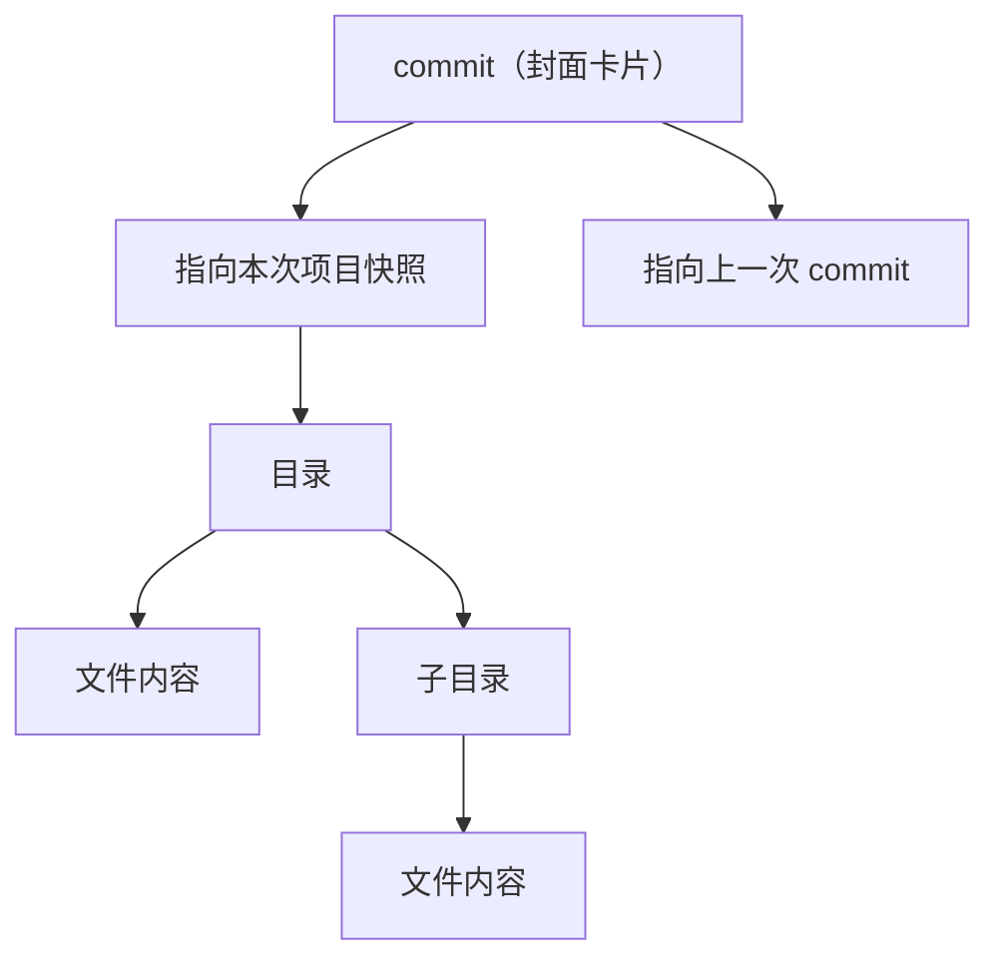

---

## 2. 一次提交到底经历了什么

我们不先背命令，而是跟踪一次最小操作。

### 2.1 准备一个实验仓库

```bash
git init git-lab
cd git-lab
printf '第一版内容\n' > note.txt
```

此时你只是在普通文件夹中创建了 `note.txt`。Git 知道工作区里出现了一个文件，但还没有把它纳入下一次快照。

`.git` 目录才是仓库本体。工作区删掉后，历史对象仍可能存在；`.git` 删掉后，这个目录就只剩普通文件，不再有 Git 历史。

### 2.2 `git add` 不是"上传"，也不只是"标记一下"

执行：

```bash
git add note.txt
```

这一步至少包含两个重要动作：

1. Git 根据 `note.txt` 当前的内容，创建或复用一个内容对象；
2. Git 更新暂存区，记录"下一次提交中，路径 `note.txt` 应该指向这个内容对象"。

因此，暂存区不是一个神秘的临时文件夹，也不是把源文件完整复制进去的"缓存目录"。它更像一张**下一次快照的目录清单**。

可以把此刻的状态画成：

```text
工作区：note.txt -> 第一版内容

暂存区：
  路径 note.txt -> 内容对象 X

当前提交：还不存在
```

接着修改工作区：

```bash
printf '第二版内容\n' > note.txt
```

现在出现了一个初学者最容易困惑的状态：同一个路径同时有两个版本。

```text
工作区中的 note.txt：第二版内容
暂存区中的 note.txt：第一版内容
```

如果此时提交，提交进去的是暂存区准备好的"第一版内容"，不是书桌上后来改出的"第二版内容"。

这解释了为什么 `git add` 叫"加入暂存区"，也解释了为什么修改文件后经常需要再次执行 `git add`：你是在更新下一次快照清单，而不是给文件盖一个永久的"已跟踪"印章。

### 2.3 `git commit` 的真实过程

先把当前工作区内容重新放入暂存区：

```bash
git add note.txt
git commit -m "记录第二版内容"
```

提交时，Git 大致做了以下事情：

1. 读取暂存区；
2. 根据暂存区中的路径和对象，构造目录树；
3. 创建一个 commit 对象，让它指向这棵目录树；
4. 如果之前已有提交，让新 commit 的 `parent` 指向旧 commit；
5. 把当前分支书签移动到新 commit；
6. 写入引用移动日志，也就是 reflog。

把这个过程画出来：

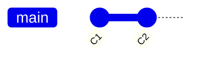

这里没有"把 C1 修改成 C2"。C1 仍然存在且不可变。Git 创建了一个新的 C2，再把 `main` 这枚书签从 C1 移到 C2。

这就是 Git 最核心的规律之一：

> **历史对象通常不可变；变化的往往是指向对象的引用。**

### 2.4 为什么提交 ID 一改内容就变

Git 对对象计算哈希值，把结果作为对象 ID。传统仓库通常使用 SHA-1，新格式仓库也可以使用 SHA-256。

哈希的输入并不只是裸内容，而是类似：

```text
对象类型 + 空格 + 内容字节数 + NUL 字节 + 对象内容
```

因此同样一段文本作为不同类型对象，ID 也不会相同。

commit 中包含父提交、目录树、作者、提交者、时间和说明等信息。任何一项变化，都可能让 commit ID 完全改变。

所以：

- 修改提交说明，commit ID 会变；
- amend 一次，commit ID 会变；
- rebase 后，即使最终文件内容相同，commit ID 往往也会变；
- cherry-pick 后产生的是新 commit，不是把旧 commit 原封不动搬过来。

---

## 3. blob、tree、commit 到底是什么

### 3.1 blob：只关心内容，不关心文件名

假设项目中有两个文件：

```text
copy-a.txt 内容为 hello
copy-b.txt 内容也为 hello
```

Git 可以让它们引用同一个 blob，因为 blob 只保存内容，不保存"这个内容叫哪个文件名"。

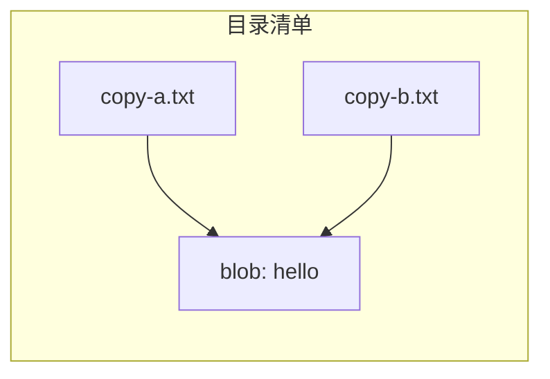

这就是内容相同可以天然复用的原因。

文件改名时，如果内容没变，blob 也不需要变化。Git 并没有一个专门的"重命名对象"；它通常是在比较两个快照时，根据相似度推断"这个删除和那个新增看起来是一次重命名"。

### 3.2 tree：目录的清单

blob 没有文件名，那么文件名放在哪里？答案是 tree。

一个 tree 对象类似：

```text
100644  blob  <对象ID-A>  README.md
100644  blob  <对象ID-B>  main.js
040000  tree  <对象ID-C>  src
```

它记录的不是文件实际内容，而是：

- 名字；
- 文件模式；
- 对象类型；
- 对象 ID。

子目录仍然是 tree，所以多个 tree 可以组成整个项目的目录树。

### 3.3 commit：给快照加上历史关系

tree 只描述"项目此刻是什么样"，但没有回答：

- 谁做的；
- 为什么做；
- 上一个版本是谁。

commit 把这些信息补齐。

一个普通 commit 的逻辑内容类似：

```text
tree <根目录 tree 的对象ID>
parent <父 commit 的对象ID>
author ...
committer ...

提交说明
```

第一次提交没有 parent；普通提交通常有一个 parent；合并提交往往有两个或更多 parent。

### 3.4 tag：给某个对象一张有说明和签名的标签

轻量标签本质上只是一个引用；附注标签则会创建 tag 对象，其中可以保存标签作者、说明和签名，再指向某个 commit 或其他对象。

不过在理解日常版本控制时，先牢牢掌握 blob、tree、commit 已经足够。

### 3.5 亲眼查看对象

下面几条命令可以帮助验证模型：

```bash
# 查看当前提交的原始内容
git cat-file -p HEAD

# 查看当前提交指向的根 tree
git cat-file -p HEAD^{tree}

# 查看某对象的类型
git cat-file -t <对象ID>
```

你会发现，Git 的底层并不神秘：一层对象指向另一层对象，最终落到文件内容。


---

## 4. 暂存区为什么是 Git 最巧妙也最容易被误解的部分

### 4.1 暂存区不是"提交前的候车室"这么简单

"候车室"这个比喻能帮助入门，但容易让人误以为文件只能处于"暂存"或"未暂存"两种状态。

更准确的理解是：

> **暂存区保存下一次提交准备使用的那棵目录树。**

因此，一个文件可以只把部分改动放入暂存区。

假设你在 `app.js` 中同时做了两件事：

- 修复登录错误；
- 顺手修改页面颜色。

良好的提交应该把两个目的拆开。你可以只把修复登录的那部分放入暂存区，先提交；剩下的颜色修改继续留在工作区。

这不是魔法，而是暂存区中的 `app.js` 可以指向一个"介于旧文件和当前工作区之间"的内容对象。

此时有三个版本：

```text
HEAD 中的 app.js：修改前
暂存区中的 app.js：只有登录修复
工作区中的 app.js：登录修复 + 颜色修改
```

所以，Git 在同一路径上同时维护三个视角并不罕见。

### 4.2 `status` 和 `diff` 其实都在做比较


- `git diff`：默认比较工作区和暂存区，看到"还没放进下一次提交"的改动；
- `git diff --cached`：比较暂存区和 HEAD，看到"下一次提交将包含什么"；
- `git diff HEAD`：比较工作区整体和 HEAD，看到从上次提交以来的全部差异。

关键不是记三个命令，而是问一句：

> 我现在想比较哪两份状态？

### 4.3 冲突时，暂存区会临时保存三个祖先版本

普通情况下，一个路径在暂存区只有 stage 0，也就是最终候选版本。

发生三路合并冲突时，暂存区可以同时记录：

- stage 1：共同祖先版本；
- stage 2：当前这一侧的版本；
- stage 3：另一侧的版本。

这解释了为什么 Git 能把冲突标记写进工作区，也解释了为什么解决冲突后要再次执行 `git add`：你不是单纯告诉 Git"我解决了"，而是在用最终文件替换暂存区中的三份冲突材料，恢复为一个 stage 0 结果。

可用下面的命令观察：

```bash
git ls-files -u
```

你会看到同一路径出现多个对象 ID。

---

## 5. 分支为什么创建得那么快

### 5.1 分支不是一份代码副本

初学者常把分支理解成"复制整个项目，再去另一份副本上开发"。如果真是这样，创建分支需要复制全部文件，大仓库会非常慢。

Git 分支本质上只是一枚可移动书签，记录一个 commit ID。

假设历史是：

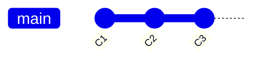

创建 `feature` 分支后：

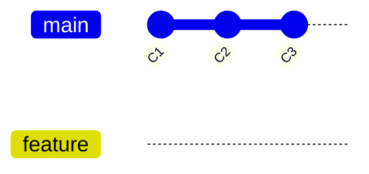

没有复制 C1、C2、C3，也没有复制所有文件。只是多了一个名字，同样指向 C3。

### 5.2 HEAD 不是"最新提交"的同义词

HEAD 表示你当前检出的位置。

最常见的状态是：

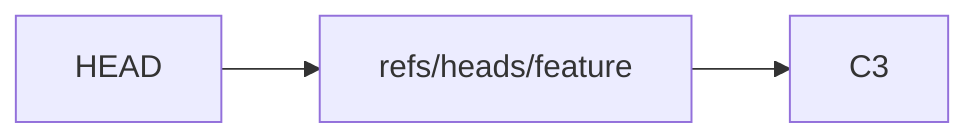

意思是：你当前在 `feature` 分支上，而 `feature` 指向 C3。

在 `feature` 上提交 C4 后：

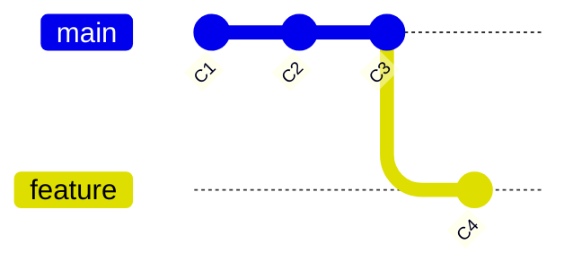

Git 知道应当移动 `feature`，因为 HEAD 指向它；`main` 留在原地。

### 5.3 detached HEAD 到底是什么

你也可以直接检出某个 commit，而不是某个分支：

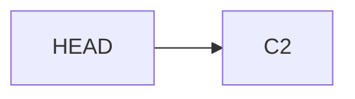

这叫 detached HEAD。它不是仓库损坏，只是当前没有分支书签跟随你移动。

如果你在这个状态创建了新提交：

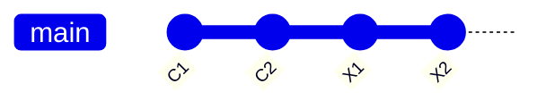

X1、X2 真实存在，但没有普通分支名字指向它们。切走后它们容易变得难找。

解决方法不是恐慌，而是在切走前创建分支：

```bash
git switch -c experiment
```

这相当于给当前提交贴上一枚书签。

### 5.4 切换分支时为什么可能被拒绝

切换分支不是只改一个指针。Git 还要把工作区和暂存区调整成目标提交对应的快照。

如果当前未提交修改会被目标分支覆盖，Git 通常拒绝切换，以保护你的工作。

因此"切分支"包含两类动作：

1. 改变 HEAD 指向；
2. 尝试让暂存区和工作区匹配目标提交。

这也解释了为什么一个脏工作区会影响分支切换。

---

## 6. Git 历史不是链表，而是一张永远向过去指的图

### 6.1 普通提交看起来像链表

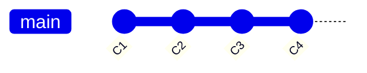

箭头表示"新提交记录父提交"。从 C4 可以一路沿 parent 找到过去。

### 6.2 分叉后变成图


A1 和 B1 都把 C2 作为 parent。两个开发方向共享此前历史，没有复制。

### 6.3 合并不会产生环

合并后可能出现一个有两个 parent 的提交：

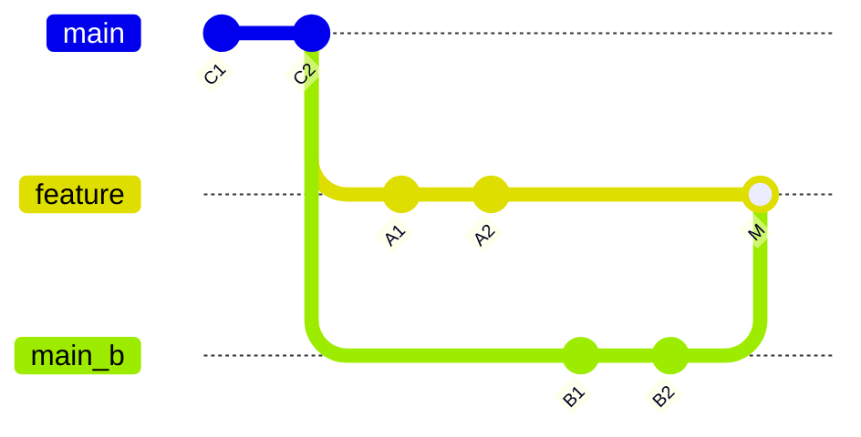

M 的两个 parent 是 A2 和 B2。所有箭头仍然只指向更早已经存在的提交，所以不会沿 parent 回到 M。

因此 Git 历史是 **有向无环图（DAG）**，不是"环状结构"。

### 6.4 可达性是很多规则背后的真正核心

从某个提交沿 parent 一直向过去走，能够遇到的提交称为从它"可达"。

很多 Git 行为都可以用可达性解释：

- 日志：列出从某个引用可达的提交；
- 分支是否已合并：分支尖端是否已经从目标分支可达；
- 普通 push 是否允许：远程旧提交是否是本地新提交的祖先；
- 垃圾回收：对象是否仍能从某个引用或保留机制到达；
- `A..B`：从 B 可达但从 A 不可达的提交集合。

"祖先"和"可达"比背诵各种命令规则更重要。

---

## 7. merge 为什么有时只是移动指针，有时却会冲突

### 7.1 先理解 fast-forward

假设你从 `main` 创建了 `feature`，之后 `main` 没有产生新提交：

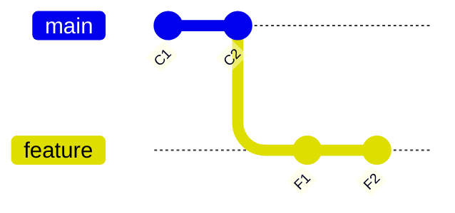

此时把 `feature` 合回 `main`，`main` 只需要向前移动到 F2：

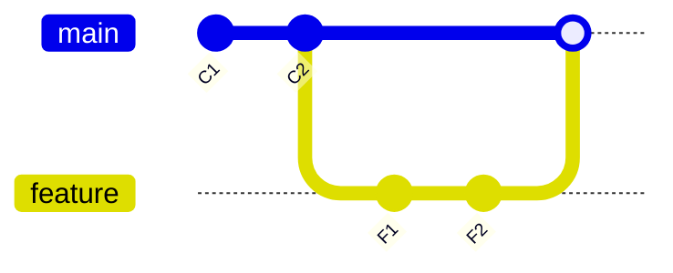

没有必要创建合并提交，因为历史本来就是一条直线。这叫 fast-forward。

它的本质不是"合并文件"，而是：

> 目标分支指向的旧提交，本来就是来源分支新提交的祖先，所以安全地把书签向前移动即可。

### 7.2 真正分叉时为什么需要三路合并

如果两边都继续开发：

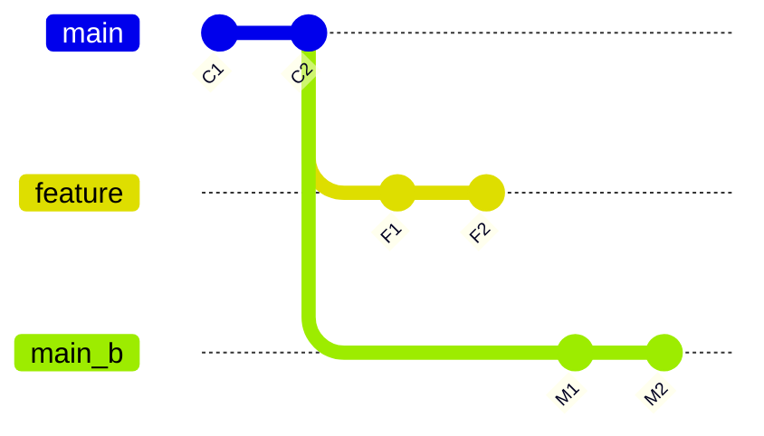

只比较 F2 和 M2 不够。假设同一行内容不同，你无法判断：

- feature 修改了它；
- main 修改了它；
- 还是某一侧根本没动，只保留了旧值。

因此 Git 还要找到双方的共同祖先 C2，同时比较三份内容：

```text
共同祖先 C2
当前分支 M2
待合入分支 F2
```

这叫三路合并。

#### 一个直观例子

共同祖先中的文件：

```text
标题：Git 教程
作者：小明
```

main 改成：

```text
标题：Git 原理教程
作者：小明
```

feature 改成：

```text
标题：Git 教程
作者：小明和小红
```

Git 可以看出：一边改标题，另一边改作者，通常可以自动合并：

```text
标题：Git 原理教程
作者：小明和小红
```

如果两边都把标题改成不同内容，Git 无法替人决定哪一个正确，就产生冲突。

### 7.3 冲突不是 Git 失败，而是信息不足

Git 能判断文本变化，却不知道业务含义。

比如：

```text
main:    timeout = 30
feature: timeout = 60
base:    timeout = 10
```

两边都修改了同一个位置。Git 无法知道 30 和 60 谁符合产品需求，因此把选择权交给人。

工作区通常会看到：

```text
<<<<<<< HEAD
timeout = 30
=======
timeout = 60
>>>>>>> feature
```

这些标记不是最终结果，而是 Git 展示两边材料。你需要编辑成真正想要的内容，例如：

```text
timeout = 45
```

然后执行 `git add`，把这个人工决定写入下一次快照。

### 7.4 合并提交为什么有两个 parent

解决后创建的合并提交 M 会记录：

```text
parent = 合并前 main 的尖端 M2
parent = 被合入 feature 的尖端 F2
```

它表达的不是"我复制了 feature"，而是：

> 从这一刻起，这个版本同时继承了两条历史。

这使得未来 Git 可以判断 feature 的历史已经被包含。

### 7.5 当前 Git 的合并实现

现代 Git 对普通两头合并默认使用 `ort` 合并策略。它负责寻找合并基点、处理目录和文件重命名、合并树并产生冲突材料。

merge 并不是简单把两个目录覆盖到一起，而是在提交图上寻找共同祖先，再对三个快照进行结构化比较。


---

## 8. rebase 到底"移动"了什么

### 8.1 rebase 不是把原提交直接搬过去

原历史：


feature 是从 C2 分出的，但现在 main 已经到了 M2。执行 rebase 后，看起来像：

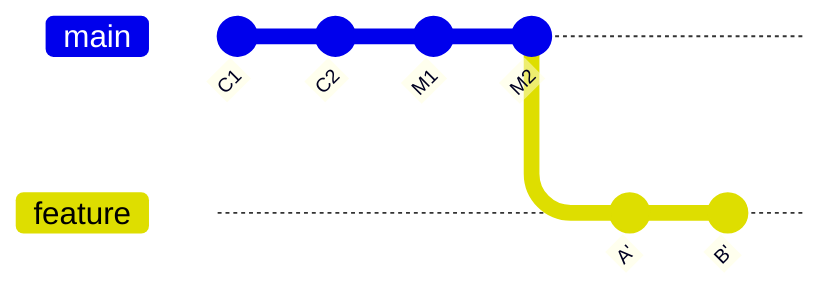

注意是 A'、B'，不是原来的 A、B。

Git 大致做的是：

1. 找到 feature 相对于 main 独有的提交 A、B；
2. 提取 A 相对其父提交带来的变化；
3. 以 M2 为新基础应用这份变化，生成 A'；
4. 再把 B 的变化应用到 A'，生成 B'；
5. 把 feature 书签移动到 B'。

原来的 A、B 没被原地修改。它们暂时仍可能存在，只是 feature 不再指向它们。

### 8.2 为什么 rebase 后 ID 必然常常变化

A' 的 parent 从 C2 变成了 M2。commit 内容中包含 parent，因此即使最终文件内容看起来一样，哈希输入也不同，ID 就不同。

B' 的 parent 又变成 A'，所以 B' 也不同。

这就是"rebase 改写历史"的真正含义：

> 它不是修改旧 commit，而是创建一串内容效果相近、父关系不同的新 commit，再移动分支。

### 8.3 为什么公共历史不要随意 rebase

假设你已经把 A、B 推给同事，同事在 B 上继续创建 C：


你本地 rebase 后得到 A'、B' 并强推：

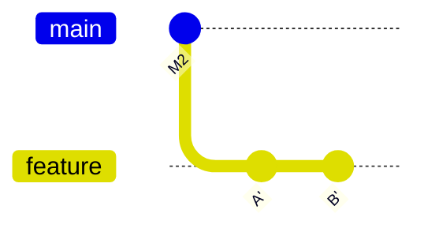

从 Git 看，A 和 A' 是两个不同提交，B 和 B' 也是。之后双方再次同步时，历史可能出现重复提交、复杂冲突或需要人工重整。

因此更准确的原则是：

- 自己尚未共享的提交，可以用 rebase 整理；
- 已经被其他人基于其开发的提交，优先保留；
- 团队若明确约定可重写某类分支，也要使用安全的强推方式并沟通。

### 8.4 merge 和 rebase 不是谁高级，而是表达不同故事

#### merge 表达真实汇合

```text
两条开发线曾经并行，后来在这里汇合。
```

优点是保留真实拓扑，不改写已有提交。

#### rebase 表达线性叙事

```text
把我的工作假想成从最新 main 开始逐步完成。
```

优点是历史更直，但代价是重新创建提交。

选择标准不应是"哪个命令更酷"，而应是：

- 是否允许改写这些提交；
- 团队是否需要保留分支汇合语义；
- 审查和回滚是否依赖完整拓扑；
- 当前提交是否只属于你个人。

### 8.5 交互式 rebase 为什么能改说明、合并和删除提交

交互式 rebase 本质仍是"重新创建一串提交"。既然本来就要重放，Git 可以在每一步询问：

- 这个提交保留吗？
- 是否修改说明？
- 是否和前一个合并？
- 是否暂停，让你修改内容？
- 是否删除？

所以 squash、reword、drop 并不是修改原对象，而是在生成新历史时改变重放方案。

---

## 9. cherry-pick、revert、reset、restore 为什么总被混淆

这几个命令都可能让"文件看起来回到了某种状态"，但底层动作完全不同。

### 9.1 cherry-pick：复制某次变化的效果

假设提交 C 的父提交是 P。C 引入的变化可以理解为：

```mermaid
flowchart LR
  P["P 的快照"] --> C["C 的快照"]
```

cherry-pick 会尝试把这份变化应用到当前 HEAD 上，并创建一个新提交 C'。

```mermaid
gitGraph
  commit id: "P"
  commit id: "C"
  checkout main
  branch current
  checkout current
  commit id: "X"
  commit id: "Y"
  commit id: "C'"
```

C' 的 parent 是 Y，时间等元数据也可能不同，所以它不是 C 本身。

适用场景是：只需要另一个开发线中的某个修复，而不是整条分支历史。

### 9.2 revert：不删除历史，而是新增一个反向提交

假设 C 把"开关=false"改成"开关=true"。revert C 会创建一个新提交 R，把效果反向改回去：

```mermaid
gitGraph
  commit id: "P"
  commit id: "C"
  commit id: "R"
```

历史仍然清楚地显示：曾经引入 C，后来通过 R 撤销。

因此 revert 很适合已经推送到共享分支的提交。它不要求所有人忘记旧历史，而是在历史末尾追加一个安全的纠正。

### 9.3 reset：移动当前分支书签，并决定另外两层跟不跟着动

reset 的核心动作是把当前分支移动到指定提交。

假设：

```mermaid
gitGraph
  commit id: "C1"
  commit id: "C2"
  commit id: "C3"
```

把 main reset 到 C1 后：

```mermaid
gitGraph
  commit id: "C1"
  commit id: "C2"
  commit id: "C3"
```

C2、C3 没被立刻删除，只是不再被 main 指向。

三种常见模式的差别是：

| 模式 | 移动分支 | 重置暂存区 | 重置工作区 |
|---|---:|---:|---:|
| `--soft` | 是 | 否 | 否 |
| `--mixed` | 是 | 是 | 否 |
| `--hard` | 是 | 是 | 是 |

所以可以这样理解：

- soft：只把书签往回移，文件和待提交清单保留；
- mixed：书签和待提交清单回到目标版本，工作区修改保留；
- hard：三层都强制变成目标版本，未提交的已跟踪文件修改可能丢失。

`--hard` 不等于"删除所有未跟踪文件"，但它会破坏已跟踪文件的未提交修改，因此使用前必须明确三层状态。

### 9.4 restore：主要恢复路径，不负责重写整条分支历史

restore 更像"从某个来源取回文件内容，写到工作区或暂存区"。

例如：

- 把工作区文件恢复成暂存区版本；
- 把暂存区文件恢复成 HEAD 版本；
- 从旧提交取出某个文件。

它关注的是路径内容，而不是移动当前分支书签。

### 9.5 一张选择图

```mermaid
flowchart TD
  q1["想安全撤销共享提交，并保留历史？"] --> revert
  q2["想把另一条线中的单个修复带过来？"] --> cp["cherry-pick"]
  q3["想移动当前分支到另一个提交？"] --> reset["reset（先判断 soft/mixed/hard）"]
  q4["只想恢复某个文件或暂存状态？"] --> restore
```

---

## 10. 远程仓库并不是"云端工作区"

### 10.1 分布式的真正含义

在一般的完整克隆中，本地 `.git` 拥有自己的对象和历史。没有网络时，你仍然可以：

- 查看日志；
- 创建提交；
- 创建分支；
- 合并和 rebase；
- 回到旧版本。

远程仓库不是本地仓库的主内存，也不是你每敲一次命令都会实时连接的中央数据库。它是另一座独立仓库。

### 10.2 `origin/main` 不是服务器 main 的实时直播

本地常见几个名字：

```mermaid
flowchart LR
  main["main：本地分支"]
  origin["origin/main：本地保存的上次获取时远程 main 的位置"]
```

当服务器 main 前进后，你本地的 `origin/main` 不会自动变化。执行 fetch 后，Git 才更新远程跟踪引用。

因此：

> `origin/main` 是一份本地记录，不是每次读取都向服务器查询。

### 10.3 fetch 做了什么

fetch 可以粗略分为两件事：

1. 和服务器协商本地缺少哪些对象；
2. 下载对象并更新远程跟踪引用。

它通常不会直接修改你的本地 `main`，也不会主动覆盖工作区。

执行 fetch 后可能出现：

```mermaid
gitGraph
  commit id: "C1"
  commit id: "C2"
  commit id: "C3"
  commit id: "C4"
```

接下来由你决定用 merge、rebase、fast-forward 或其他方式整合。

### 10.4 pull 为什么容易让人迷惑

pull 是组合操作：先 fetch，再按照配置执行整合。

问题在于"整合"可能是：

- fast-forward；
- merge；
- rebase。

如果团队没有明确配置，使用者可能以为自己只是"下载最新代码"，结果却生成了合并提交或改写了本地提交。

所以理解阶段建议把动作拆开思考：

```text
我先获取了什么？
本地和远程图现在是什么关系？
我希望怎样整合？
```

### 10.5 push 为什么会被拒绝

假设服务器 main 在 S2：

```mermaid
gitGraph
  commit id: "S1"
  commit id: "S2"
```

你的本地因为没更新，从 S1 创建了 L2：

```mermaid
gitGraph
  commit id: "S1"
  branch local
  checkout local
  commit id: "L2"
  checkout main
```

如果直接 push，服务器必须把 main 从 S2 改指向 L2。这样 S2 将不再从 main 可达，等于覆盖别人已经推送的历史。普通 push 因此拒绝非快进更新。

正确做法通常是先获取 S2，把本地工作整合到它之后，再推送：

```mermaid
gitGraph
  commit id: "S1"
  commit id: "S2"
  commit id: "L2'"
```

此时服务器旧位置 S2 是新位置 L2' 的祖先，属于 fast-forward 更新。

### 10.6 `--force-with-lease` 为什么比 `--force` 安全

强推意味着允许远程引用向非快进方向移动。

`--force` 基本是在说："无论服务器现在是什么，都按我的位置改。"

`--force-with-lease` 则增加了条件："只有服务器仍处于我所预期的位置时才改；如果别人又推了新内容，就拒绝。"

它不是绝对安全，但至少避免在不知情时覆盖刚刚出现的远程更新。

### 10.7 网络上传输的不是整个工作区

fetch 和 push 的核心是交换：

- 引用位置；
- 缺失的对象；
- 被打包和压缩后的对象数据。

服务器和客户端会通过"我想要哪些提交""我已经有哪些提交"的协商，尽量只传输缺少的部分。对象通常以 packfile 形式传输，而不是把每个文件逐个重新上传。

---

## 11. Git 的对象在磁盘上怎样存放

### 11.1 loose object：对象刚产生时的朴素形态

在传统对象格式仓库中，一个对象 ID 可能类似：

```text
8ab686eafeb1f44702738c8b0f24f2567c36da6d
```

Git 通常取前两个字符作为目录名，剩余字符作为文件名：

```text
.git/objects/8a/b686eafeb1f44702738c8b0f24f2567c36da6d
```

对象内容不是直接明文存放，而是带上对象头后经过 zlib 压缩。

概念上：

```text
blob 12\0hello world\n
```

然后压缩写入对象文件。

为什么目录要拆成两级？如果把海量对象全部放进同一个目录，一些文件系统在查找和列举时会变慢。使用 ID 前缀分散存储更合适。

### 11.2 对象为什么几乎可以看作不可变

对象文件名由内容计算得到。如果直接修改对象内容而不改文件名，Git 再计算哈希时会发现不匹配；如果内容正常变化，就会得到另一个 ID，存成另一个对象。

所以正常工作方式不是"编辑旧对象"，而是：

```mermaid
flowchart LR
  old["旧内容"] --> old_id["旧对象 ID"]
  new["新内容"] --> new_id["新对象 ID"]
```

这种内容寻址带来几个好处：

- 相同内容自动复用；
- 对象损坏可以被检测；
- 不同仓库可以根据 ID 判断是否已经拥有某个对象；
- 快照之间可以共享绝大多数未变化内容。

### 11.3 packfile：对象多了以后为什么要打包

如果一个项目有几十万个对象，每个对象一个小文件，会浪费文件系统空间并增加打开文件的成本。

Git 会把许多对象整理进 `.pack` 文件，并用 `.idx` 索引快速定位。

此外，相似对象可能使用 delta 压缩。例如一个 10 MB 文档只改了几行：

```text
基础对象：完整内容
新对象：基于基础对象增加、删除哪些字节
```

这只是物理压缩方式。逻辑上，新对象仍然代表完整内容；读取时 Git 会还原它。

因此不要混淆：

- Git 的逻辑版本模型是快照；
- packfile 可以用差量压缩节省物理空间。

### 11.4 `git gc` 并不是简单"删除垃圾"

仓库使用一段时间后，会产生很多 loose objects、旧 pack 和暂时不可达对象。维护过程可能进行：

- 把松散对象打包；
- 重新组织 pack；
- 生成加速索引；
- 在满足过期条件后清理不可达对象；
- 优化引用存储和提交图数据。

Git 通常会自动维护。不要因为看到对象很多就随意删除 `.git/objects` 中的文件；这会直接破坏历史。

### 11.5 commit-graph、位图和多包索引是什么思路

它们的目的都很朴素：**给已有真实数据增加更快的查找路径。**

- commit-graph：预先记录提交的父关系、代数信息等，加快历史遍历；
- changed-path Bloom filter：帮助判断某个提交是否可能改过某路径；
- bitmap：帮助快速计算一组提交可达哪些对象，常用于克隆、fetch 和打包；
- multi-pack-index：让 Git 在多个 pack 中快速定位对象，而不必立刻合成一个巨大 pack。

它们不会改变 commit、tree、blob 的基本语义，只是优化"怎么找得更快"。


---

## 12. 引用、reflog 与"Git 为什么经常能后悔"

### 12.1 分支只是引用的一种

Git 中有很多"名字指向对象"的结构，统称为引用（ref）。常见命名空间：

```text
refs/heads/       本地分支
refs/remotes/     远程跟踪引用
refs/tags/        标签
```

过去常见的实现是把引用保存成文本文件，内容是对象 ID。大量引用还可能压入 `packed-refs`。现代 Git 也支持 reftable 后端，用日志结构的表来存储引用和 reflog。

实现形式可能演进，但抽象不变：

> 一个有名字、可以原子更新的指针，指向某个对象或另一个引用。

### 12.2 reflog 记录的不是项目历史，而是本地引用移动历史

commit 历史回答："这些版本的父子关系是什么？"

reflog 回答："我本地这枚引用最近从哪里移动到了哪里？"

例如你执行：

- commit；
- reset；
- rebase；
- 切换分支；
- amend；

HEAD 或分支引用发生移动，reflog 通常会留下记录。

查看：

```bash
git reflog
```

可能看到：

```text
abc1234 HEAD@{0}: reset: moving to HEAD~2
def5678 HEAD@{1}: commit: 完成订单功能
...
```

即使你把分支 reset 回去了，旧提交 `def5678` 仍可能通过 reflog 找到。

### 12.3 为什么说"可能找回"，而不是"永远找回"

reflog 是本地、会过期的恢复线索。不可达对象也可能在维护和过期后被清理。

因此误操作后的正确习惯是：

1. 先停止执行会继续改写或清理仓库的命令；
2. 查看 reflog；
3. 找到目标提交后立即创建临时分支保护；
4. 再分析如何恢复。

例如：

```bash
git switch -c rescue <找回的提交ID>
```

创建分支后，目标提交重新变得可达，更不容易被清理。

### 12.4 ORIG_HEAD 是什么

某些可能大幅移动 HEAD 的命令，会把操作前的位置记在 `ORIG_HEAD` 中，例如部分 merge、reset 或 rebase 场景。

它可以作为快捷恢复点，但不能代替理解 reflog，因为不是所有操作和所有历史位置都依赖它保存。

---

## 13. 真正理解"冲突"的全过程

### 13.1 冲突发生前，Git 已经做了很多工作

以 merge 为例，Git 会：

1. 找共同祖先；
2. 对比祖先与当前分支；
3. 对比祖先与另一分支；
4. 自动合并能确定的路径；
5. 把不能确定的路径留给人。

所以发生冲突并不代表整个合并都失败了。很多文件可能已经自动合并完成，只有少数路径需要决定。

### 13.2 冲突标记的三方含义

建议配置 `zdiff3` 冲突样式，它除了展示两边，还能展示共同祖先，便于理解"双方各自改了什么"。

概念上：

```text
<<<<<<< 当前侧
当前侧内容
||||||| 共同祖先
原始内容
=======
另一侧内容
>>>>>>> 另一侧
```

看到共同祖先后，你就不再只是从两个结果中二选一，而能判断每一侧相对原始内容进行了什么修改。

### 13.3 ours 和 theirs 为什么在 rebase 中容易感觉反了

merge 时通常很好理解：

- ours：当前检出的分支；
- theirs：正在合入的另一侧。

rebase 是把你的提交逐个重放到新基础上。重放过程中，Git 眼中的"当前累计结果"是新基础那一侧，被重放的原提交变化则像另一侧。因此提示中的 ours/theirs 可能和人的直觉相反。

不要只凭词语盲选。应该查看：

- 当前正在重放哪个提交；
- 共同祖先内容；
- 两边具体差异；
- 最终业务上需要什么。

### 13.4 解决冲突的标准心态

不要急着运行"全部接受当前"或"全部接受传入"。正确流程是：

1. 先读冲突上下文；
2. 理解两边各自目的；
3. 写出第三个真正正确的结果；
4. 运行测试；
5. 把最终文件加入暂存区；
6. 继续 merge、rebase 或 cherry-pick。

冲突解决不是文本拼接，而是一次小型代码审查。

### 13.5 rerere 为什么能复用冲突解决

Git 的 rerere 会记录某种冲突形态以及你最后如何解决。以后遇到相同冲突时，它可以重用之前的解决结果。

它并不是"学习业务逻辑"，只是识别相同冲突材料与结果。长期维护分支、反复 rebase 或合并时非常有用，但仍应检查和测试自动复用后的结果。

---

## 14. 一套不依赖背诵的日常协作方法

### 14.1 开始工作前先画图，而不是先 pull

假设你在功能分支。开始前先获得远程信息：

```bash
git fetch
```

然后思考：

```text
我的分支从哪里分出？
main 是否已经前进？
我的提交是否已经共享？
我要保留汇合历史，还是整理成线性历史？
```

只有回答这些问题后，才决定 merge 或 rebase。

### 14.2 一个稳健的功能开发流程

#### 第一步：从最新主线创建功能分支

```bash
git switch main
git pull --ff-only
git switch -c feature/order
```

这里 `--ff-only` 的意义是：如果本地 main 出现了独立提交，不偷偷替你生成合并，而是停下来让你看清历史。

#### 第二步：按"一个目的"组织提交

不要按照"今天下班了"提交，也不要把格式化全项目、修 bug、改接口混在一起。

一个好提交应当：

- 有单一目的；
- 能独立解释；
- 最好能通过测试；
- 说明"为什么"，不只是"改了什么"。

暂存区的价值正是在这里：它允许从混合工作区中挑出一个逻辑变化。

#### 第三步：准备合入前整理私人历史

如果功能分支尚未共享，可以使用交互式 rebase：

- 修正提交说明；
- 合并零碎修补提交；
- 删除无意义试验；
- 调整顺序；
- 在每个提交后运行测试。

目标不是追求漂亮，而是让审查者能按逻辑理解。

#### 第四步：同步主线

两种常见策略：

- merge 主线：保留分叉和汇合；
- rebase 到主线：把私人功能提交重新放到最新主线之后。

由团队约定决定，不应个人随意混用。

#### 第五步：合入后删除分支

删除分支只是删除书签，不会删除已经从 main 可达的提交。

这也是为什么"分支已合并后可以安全删除"：内容已经通过 main 的历史可达。

### 14.3 不要把远程平台概念和 Git 本体混为一谈

Pull Request、Merge Request、代码评审、保护分支、流水线属于托管平台和团队流程。Git 本体提供的是对象、引用和传输机制。

平台最终通常仍会选择一种方式更新目标分支：

- 创建 merge commit；
- squash 成一个新提交；
- rebase 后线性加入；
- fast-forward。

理解底层后，你就能看懂平台按钮实际改变了提交图什么位置。

### 14.4 为什么不建议日常使用裸 `git push --force`

强推不是"推得更用力"，而是允许远程分支放弃原有尖端。

只有在明确重写某个允许重写的分支时才考虑使用，并优先：

```bash
git push --force-with-lease
```

同时先 fetch，确认远程没有别人新增的提交，并与协作者沟通。

---

## 15. 常见事故如何从原理恢复

### 15.1 提交到了错误分支

场景：你本应在 feature 上提交，却提交到了 main。

先不要删除文件。创建或移动正确分支指向这个提交，然后把 main 移回去。

思路：

```mermaid
flowchart LR
  bad["错误提交对象是好的"] --> tag["错的是书签位置"]
```

典型步骤：

```bash
# 在错误提交当前位置创建正确分支
git branch feature/right-place

# 再把 main 恢复到提交前位置
git reset --hard HEAD~1
```

前提是该提交还没有作为共享历史推送；若已经共享，通常应考虑 revert，而不是重写 main。

### 15.2 `reset --hard` 回退过头

立即查看：

```bash
git reflog
```

找到 reset 前的 HEAD，先创建保护分支：

```bash
git branch rescue-before-reset <旧ID>
```

然后再决定 reset 回去、cherry-pick，还是只取回某个文件。

### 15.3 amend 后发现改错了

amend 会创建新 commit 并移动分支，旧 commit 通常仍在 reflog 中。找到 `commit (amend)` 前的位置即可。

### 15.4 rebase 做乱了

如果操作仍在进行：

```bash
git rebase --abort
```

如果已经完成但结果错误，查看 reflog 中 rebase 开始前的位置，创建救援分支。不要在慌乱中连续 rebase、reset、gc，因为每一步都会增加判断难度。

### 15.5 已经推送的错误提交

共享分支上优先考虑 revert：追加一个反向提交，而不是让所有协作者的历史突然失效。

### 15.6 未跟踪文件被删除

Git 主要保护已经进入对象数据库或暂存区的内容。一个从未 `add`、从未提交、又被系统删除的文件，Git 通常没有副本。

这提醒我们：

> Git 是版本控制，不是全盘实时备份。

重要但尚未完成的工作，可以提交到临时分支、使用 stash，或依靠编辑器/系统备份。

### 15.7 恢复问题的统一解法

每次事故都先回答四个问题：

1. 好的内容是否已经成为 Git 对象？
2. 现在还有哪个引用或 reflog 能到达它？
3. 我需要恢复的是提交图、暂存区，还是工作区文件？
4. 这段历史是否已经共享？

只要这四个问题答清，命令往往只是最后一步。


---

## 16. 从源码视角看，一条 Git 命令怎样落到底层

### 16.1 Git 并不是一个巨大单体命令

当你输入：

```bash
git commit
```

顶层程序会解析子命令并调用对应实现。Git 源码中许多面向用户的命令入口位于 `builtin/`，底层能力则分散在对象、索引、引用、diff、revision walk、merge 和传输等模块中。

### 16.2 `git add` 的实现链路

简化后的链路是：

```mermaid
flowchart TD
  step1["读取工作区路径"]
  step2["判断文件状态、模式和内容"]
  step3["把内容写成 blob（若对象已存在则复用）"]
  step4["更新内存中的 index 条目"]
  step5["通过锁文件原子写回 .git/index"]
  step1 --> step2 --> step3 --> step4 --> step5
```

为什么要锁文件？假设两个进程同时直接覆盖 index，仓库可能得到半写入状态。Git 常见做法是先写 `.lock` 临时文件，完成后原子改名替换目标。

这类"先锁定、完整写入、再替换"的模式，也用于很多引用更新。

### 16.3 `git commit` 的实现链路

简化为：

```mermaid
flowchart TD
  s1["读取 index"]
  s2["根据路径层级写出 tree 对象"]
  s3["读取当前 HEAD，确定 parent"]
  s4["构造 commit 内容并写对象"]
  s5["原子更新当前分支引用"]
  s6["追加 reflog"]
  s1 --> s2 --> s3 --> s4 --> s5 --> s6
```

如果写完 commit 对象后，引用更新失败，会出现对象已经存在但暂时不可达的情况。这通常不会破坏原历史，因为旧引用还没被替换。

"先写不可变对象，最后移动引用"的顺序，是 Git 安全性的重要来源之一。

### 16.4 merge 实现关注的是"树"，不是逐文件盲拼

现代默认 `ort` 策略大致需要处理：

- 一个或多个合并基点；
- 两边目录树变化；
- 文件新增、删除、修改；
- 文件和目录重命名；
- 路径冲突；
- 内容级三路合并；
- 冲突条目写入 index。

源码中 `merge-ort` 相关实现的重点，是高效地把三棵树的变化归并为结果树和冲突集合。

### 16.5 rebase 和 cherry-pick 为什么会共享"顺序执行器"思想

rebase、cherry-pick 和 revert 都可能需要：

1. 按顺序处理一组提交；
2. 应用某个提交带来的变化；
3. 遇到冲突暂停；
4. 用户解决后继续；
5. 支持 abort、continue、skip。

因此 Git 中存在 sequencer 一类机制来管理"当前执行到哪一步、待执行列表是什么、暂停状态是什么"。

这解释了为什么仓库在操作中会出现类似：

```text
.git/rebase-merge/
.git/sequencer/
CHERRY_PICK_HEAD
MERGE_HEAD
```

它们是进行中操作的状态记录。不要在不理解的情况下手工删除；优先使用对应的 `--continue` 或 `--abort`。

### 16.6 refs 后端为什么是可替换的

从用户模型看，分支就是名字到对象 ID 的映射。但如何高效、原子地存储海量引用，是另一个实现问题。

传统 files 后端使用：

- 独立引用文件；
- `packed-refs`；
- 各自的 reflog 文件。

现代 Git 也支持 reftable 后端，把引用和 reflog 组织在适合追加、压缩和查询的表中。

在 Git 中，上层命令依赖"引用接口"，不应依赖"分支一定是某个文本文件"这一偶然实现。

所以学习时要区分：

- 稳定抽象：branch 是 ref；
- 具体后端：ref 可能由 files 或 reftable 保存。

### 16.7 当前版本演进不改变核心模型

截至 2026 年 6 月，Git 2.54.0 是最新正式版本。Git 在持续增加历史改写、仓库信息、大仓库维护和哈希迁移等能力，但最核心的模型仍然稳定：

```text
内容寻址对象 + 提交图 + 引用 + index + 工作区
```

学习最新功能之前，先掌握这五块。否则新命令越多，只会增加记忆负担。

---

## 17. 四个实验，把抽象原理变成亲眼可见

### 实验一：观察一次 add 和 commit 分别增加什么

#### 目标

验证：

- 新建普通文件不会立即创建 Git 对象；
- add 会写 blob 并更新 index；
- commit 会写 tree、commit 并移动分支引用。

#### 步骤

```bash
mkdir git-internals-lab
cd git-internals-lab
git init

git config user.name "Lab User"
git config user.email "lab@example.com"

printf 'hello\n' > a.txt
```

先查看对象目录：

```bash
find .git/objects -type f
```

此时通常没有业务对象。

执行：

```bash
git add a.txt
find .git/objects -type f
```

应该出现一个 loose object。查看暂存区：

```bash
git ls-files --stage
```

输出中会看到 `a.txt` 对应的 blob ID。

提交：

```bash
git commit -m "add a"
```

再查看：

```bash
find .git/objects -type f
git cat-file -p HEAD
git cat-file -p HEAD^{tree}
```

尝试回答：

1. blob、tree、commit 分别是谁指向谁？
2. `a.txt` 的文件名出现在哪一层？
3. 当前分支引用中保存的是什么？

#### 再做一步：验证相同内容复用

```bash
cp a.txt b.txt
git add b.txt
git ls-files --stage
git commit -m "add same-content copy"
```

观察 `a.txt` 和 `b.txt` 是否指向同一个 blob ID。

这能证明 blob 按内容寻址，而文件名属于 tree/index 这一层。

---

### 实验二：验证暂存区可以保存"中间版本"

#### 步骤

创建并提交初始文件：

```bash
cat > story.txt <<'TXT'
标题：旧标题
作者：小明
TXT

git add story.txt
git commit -m "initial story"
```

只改标题，然后 add：

```bash
cat > story.txt <<'TXT'
标题：新标题
作者：小明
TXT

git add story.txt
```

再改作者，但不要 add：

```bash
cat > story.txt <<'TXT'
标题：新标题
作者：小明和小红
TXT
```

现在分别执行：

```bash
git diff
git diff --cached
git show HEAD:story.txt
git show :story.txt
cat story.txt
```

你会看到三份不同状态：

```text
HEAD：旧标题 + 小明
index：新标题 + 小明
工作区：新标题 + 小明和小红
```

这是理解 Git 状态模型最关键的实验。

---

### 实验三：亲手制造分叉、merge 和冲突

#### 准备共同祖先

```bash
git switch -c main 2>/dev/null || git switch main

cat > config.txt <<'TXT'
timeout=10
mode=safe
TXT

git add config.txt
git commit -m "add config"
```

创建 feature：

```bash
git switch -c feature
echo 'timeout=60' > config.txt
echo 'mode=safe' >> config.txt
git add config.txt
git commit -m "feature increases timeout"
```

回 main 做冲突修改：

```bash
git switch main
echo 'timeout=30' > config.txt
echo 'mode=safe' >> config.txt
git add config.txt
git commit -m "main adjusts timeout"
```

查看图：

```bash
git log --graph --oneline --all
```

合并：

```bash
git merge feature
```

发生冲突后：

```bash
git ls-files -u
```

用 `git cat-file -p` 查看三个 stage 对应的 blob，确认它们分别是祖先、当前侧和另一侧。

然后把 `timeout` 决定为一个业务上正确的值，例如 45：

```bash
cat > config.txt <<'TXT'
timeout=45
mode=safe
TXT

git add config.txt
git commit
```

最后查看合并提交：

```bash
git cat-file -p HEAD
git log --graph --oneline --all
```

确认它有两个 parent，但历史没有形成环。

---

### 实验四：比较 merge 与 rebase 的对象结果

回到实验前共同位置，建立两组相同分叉，分别执行 merge 和 rebase。

重点不要只看文件，而要记录：

- 操作前后的 commit ID；
- parent 关系；
- 分支引用移动；
- 原提交是否还能在 reflog 找到。

建议使用：

```bash
git log --graph --oneline --decorate --all
git reflog
git cat-file -p <commit>
```

你应当得出：

- merge 通常保留双方原 commit，并可能新增一个多父 commit；
- rebase 为被重放的提交创建新对象，并移动分支；
- 两者最终工作区内容可能完全相同，但历史图不同。


---

## 18. 一个完整案例——从开发到合入再到恢复

假设三个人维护一个订单系统：

- `main`：稳定主线；
- 小明开发优惠券；
- 小红修复支付超时；
- 服务器托管共享仓库。

### 18.1 小明创建功能分支

最初：

```mermaid
gitGraph
  commit id: "C1"
  commit id: "C2"
```

小明创建 `feature/coupon`。这只是新建引用：

```mermaid
gitGraph
  commit id: "C1"
  commit id: "C2"
  branch feature/coupon
```

之后小明提交 A、B：

```mermaid
gitGraph
  commit id: "C1"
  commit id: "C2"
  branch feature/coupon
  checkout feature/coupon
  commit id: "A"
  commit id: "B"
  checkout main
```

### 18.2 小红先把修复合入 main

服务器主线前进：

```mermaid
gitGraph
  commit id: "C1"
  commit id: "C2"
  commit id: "P"
```

小明本地 fetch 后：

```mermaid
gitGraph
  commit id: "C1"
  commit id: "C2"
  branch origin/main
  checkout origin/main
  commit id: "P"
  checkout main
  branch feature
  checkout feature
  commit id: "A"
  commit id: "B"
```

### 18.3 小明如何选择整合策略

如果 A、B 尚未共享，团队偏好线性历史，小明可以 rebase：

```mermaid
gitGraph
  commit id: "C1"
  commit id: "C2"
  commit id: "P"
  branch feature
  checkout feature
  commit id: "A'"
  commit id: "B'"
```

如果功能分支多人协作，或团队需要保留真实分叉，则可以 merge main：

```mermaid
gitGraph
  commit id: "C1"
  commit id: "C2"
  branch origin
  checkout origin
  commit id: "P"
  checkout main
  branch feature
  checkout feature
  commit id: "A"
  commit id: "B"
  checkout main
  merge feature id: "M"
```

两种结果都可能正确。关键是团队语义与历史是否允许重写。

### 18.4 合入后发现优惠券有问题

如果 B 已经进入共享 main，最稳妥的方法通常是创建 revert 提交 R：

```mermaid
gitGraph
  commit id: "B"
  commit id: "R"
```

如果只是小明私人分支，还没推送，可以通过 reset、交互式 rebase 或 amend 整理。

"是否共享"决定了你应该追加历史还是重写历史。

### 18.5 小明误把本地分支 reset 掉

他运行了 hard reset，功能提交从分支图上消失。此时：

- A'、B' 很可能仍是对象；
- reflog 记录了 reset 前的位置；
- 立即创建救援分支即可保护。

这套恢复不依赖记忆某个神奇命令，而是因为：reset 主要移动书签，旧对象不会马上蒸发。

---

## 19. 精通 Git 后应具备的判断能力

### 19.1 看到命令前先问它会改什么

把 Git 状态拆成五层：

```mermaid
flowchart TD
  remote["远程引用/另一仓库"]
  refs["引用与 HEAD"]
  objects["对象数据库"]
  index["暂存区 index"]
  workdir["工作区"]
  workdir --> index --> objects --> refs --> remote
```

任何操作先判断：

- 是否创建对象？
- 是否移动引用？
- 是否改变 index？
- 是否覆盖工作区？
- 是否影响远程仓库？

例如：

```text
commit：创建 tree/commit，移动当前分支；通常不改工作区
fetch：下载对象，更新远程跟踪引用；通常不改本地分支和工作区
reset --hard：移动分支，并重置 index、工作区
revert：创建新 commit，移动当前分支
branch：通常只创建或移动引用，不复制对象
```

### 19.2 能画出操作前后的提交图

在使用 merge、rebase、reset、cherry-pick、push 前，先画简图：

```text
谁指向谁？
共同祖先是谁？
哪些提交只在一侧可达？
操作后哪个引用会移动？
会不会创建新提交？
```

图画对了，命令通常不会错。

### 19.3 能区分内容相同和历史相同

两个分支工作区完全相同，不代表 commit ID 相同，也不代表历史关系相同。

反过来，两个 commit 可能共享绝大部分 blob/tree，但因为 parent 或说明不同，commit ID 不同。

Git 同时管理：

- 项目内容；
- 历史叙事。

很多协作争议实际上不是文件内容问题，而是希望用怎样的历史表达开发过程。

### 19.4 能判断什么时候应当停止操作

真正熟练的人不是从不出错，而是在异常时减少二次破坏。

看到不理解的状态时：

1. 不连续尝试多个破坏性命令；
2. 查看 status；
3. 查看图和 reflog；
4. 复制仓库或创建救援分支；
5. 再处理。

Git 中最昂贵的事故，往往不是第一次错误，而是慌乱中的第二、第三次错误。

---

## 20. 最终心智模型——把所有知识压缩成一张图

```mermaid
flowchart TD
  subgraph 远程仓库
    remote_objects["对象"]
    remote_refs["远程引用"]
  end
  remote_objects -- fetch --> dotgit
  dotgit -- push --> remote_objects

  subgraph dotgit["本地 .git 仓库"]
    ref_layer["引用层：HEAD → branch → commit"]
    obj_layer["对象层：commit → root tree → tree/blob"]
    obj_layer -.-> parent["parent commit(s)"]
    ref_layer --> obj_layer
    aux["辅助存储：reflog、pack、commit-graph"]
  end

  subgraph index_layer["index"]
    idx["下一次提交候选快照<br/>冲突时可含 stage 1/2/3"]
  end

  subgraph work_layer["工作区"]
    ws["用户当前看到和编辑的文件"]
  end

  idx -- commit --> dotgit
  ws -- add --> idx
```

然后把主要操作放回这张图：

```text
add       工作区 -> blob/index
commit    index -> tree/commit，并移动当前分支
branch    创建一枚指向 commit 的引用
switch    改变 HEAD，并尝试更新 index/工作区
merge     用共同祖先合并两条历史，可能创建多父 commit
rebase    在新基础上重新创建一串 commit，再移动分支
reset     移动分支，并可选重置 index/工作区
restore   恢复路径到 index 或工作区
revert    创建一个反向效果的新 commit
fetch     从远程取对象，更新远程跟踪引用
push      向远程发送对象，并请求更新远程引用
```

---

## 总结

Git 的核心可以压缩成五句话：对象根据内容寻址且不可变，tree 和 commit 组织目录和历史，引用是移动的书签，index 是下一次快照的候选，远程仓库是独立的另一座仓库。把这五句话放在心里，多数 Git 行为都可以从模型推导出来。

---

## 附录 A：必要命令最小集

### 状态与观察

```bash
git status
git diff
git diff --cached
git log --graph --oneline --decorate --all
git reflog
git show <commit>
```

### 创建快照

```bash
git add <path>
git add -p
git commit
git commit --amend
```

### 分支与整合

```bash
git switch <branch>
git switch -c <new-branch>
git merge <branch>
git rebase <upstream>
git rebase -i <base>
git cherry-pick <commit>
```

### 恢复

```bash
git restore <path>
git restore --staged <path>
git reset --soft|--mixed|--hard <commit>
git revert <commit>
```

### 远程

```bash
git fetch
git pull --ff-only
git push
git push --force-with-lease
```

### 观察底层

```bash
git cat-file -p <object>
git cat-file -t <object>
git ls-files --stage
git ls-files -u
git rev-parse <revision>
git rev-list <revision-range>
```

---

## 附录 B：自测题

尝试用"对象、引用、index、工作区、可达性"解释。

### 题目

1. 为什么创建分支几乎瞬间完成？
2. 为什么两个文件内容一样时可能共享 blob？
3. 为什么修改 commit message 会改变 commit ID？
4. 为什么 `git add` 后再次编辑文件，提交内容可能不是工作区当前内容？
5. 为什么 merge 有时不创建 commit？
6. 为什么 merge commit 不会使 Git 历史形成环？
7. 为什么 rebase 后文件内容相同，提交 ID 仍变化？
8. 为什么公共分支上的错误通常用 revert，而不是 reset + force push？
9. 为什么 fetch 后 `origin/main` 会更新，而本地 `main` 不一定更新？
10. 为什么普通 push 会拒绝非快进更新？
11. 为什么 reset 后旧提交经常还能从 reflog 找回？
12. 冲突时 index 为什么能为同一路径保存三份对象？

### 参考答案

1. 分支只是新增一个指向现有 commit 的引用，不复制项目和历史。
2. blob 按内容寻址且不含文件名，相同内容得到相同对象 ID。
3. commit 对象内容包含提交说明，内容变化会导致哈希变化。
4. index 保存独立的下一次快照候选；后续工作区修改不会自动更新 index。
5. 如果当前提交是目标提交的祖先，只需 fast-forward 移动引用。
6. 新 commit 的 parent 只指向已经存在的旧 commit，边始终朝过去。
7. rebase 改变 parent，并重新创建 commit，对象内容和哈希不同。
8. revert 追加历史，不会让协作者已有提交突然失效。
9. fetch 更新本地的远程跟踪引用，不替你决定如何改本地分支。
10. 非快进会让远程旧尖端不再从新尖端可达，可能覆盖他人历史。
11. reset 主要移动引用，reflog 通常保留移动前位置，旧对象不会立即清理。
12. 三路合并需要保存共同祖先、当前侧和另一侧，解决后再替换为 stage 0。

---

## 附录 C：推荐的 14 天训练路线

### 第 1—2 天：只研究三层状态

反复制造：

- 工作区变化；
- 暂存变化；
- 同一路径三份不同内容。

目标：看到 status 后能准确说出是哪两层不同。

### 第 3—4 天：观察对象

使用 `cat-file` 和 `ls-files --stage`，手工追踪：

```mermaid
flowchart LR
  branch --> commit --> tree --> blob
```

目标：不再把 commit 当作"装着所有文件的压缩包"。

### 第 5—6 天：分支与图

创建多次分叉、fast-forward 和 true merge。每次操作前先画图，操作后验证。

目标：能用祖先与可达性解释结果。

### 第 7—8 天：冲突

故意制造：

- 同行修改冲突；
- 删除/修改冲突；
- 重命名和修改；
- rebase 冲突。

目标：会检查 stage 1/2/3，不依赖"全选 ours/theirs"。

### 第 9—10 天：历史重写

比较：

- amend；
- interactive rebase；
- cherry-pick；
- reset；
- revert。

目标：每次都能指出哪些 commit 是新对象、哪些引用移动了。

### 第 11—12 天：远程模拟

在本机创建一个 bare 仓库和两个 clone，模拟两个人同时提交、push 被拒绝、fetch 后整合。

目标：分清 `main`、`origin/main` 和服务器 `main`。

### 第 13 天：恢复演练

故意做错：

- reset --hard；
- 删除分支；
- amend；
- rebase；
- 提交到错误分支。

全部通过 reflog 和临时分支恢复。

### 第 14 天：从零讲给别人

不看资料，用一张纸解释：

```mermaid
flowchart LR
  ws["工作区"] --> index --> objects
  HEAD --> branch --> commit --> tree --> blob
```

再解释 merge 和 rebase 的区别。如果能让没有 Git 基础的人听懂，说明模型真正建立了。

---

## 附录 D：技术准确性说明与官方资料

### 版本基线

截至 2026-06-08，kernel.org 的正式发布目录中最新版本为 Git 2.54.0，发布时间为 2026-04-20。

### 建议查阅的官方文档

- Git 官方站点：https://git-scm.com/
- Pro Git：Git Internals - Git Objects  
  https://git-scm.com/book/en/v2/Git-Internals-Git-Objects
- 仓库布局：  
  https://git-scm.com/docs/gitrepository-layout
- index 文件格式：  
  https://git-scm.com/docs/gitformat-index
- merge：  
  https://git-scm.com/docs/git-merge
- rebase：  
  https://git-scm.com/docs/git-rebase
- revision 表达式：  
  https://git-scm.com/docs/gitrevisions
- pack 格式：  
  https://git-scm.com/docs/gitformat-pack
- 哈希函数迁移：  
  https://git-scm.com/docs/hash-function-transition
- Git 源码镜像：  
  https://github.com/git/git
