# Redis 核心原理与工程实践入门

> 本文用最简单的语言，循序渐进地讲清楚 Redis 的核心概念、数据类型、性能原理以及生产环境中常见的缓存问题和解决方案。不背概念，先理解，再实践。

---

## 目录

1. [Redis 是什么？为什么用它？](#一redis-是什么为什么用它)
2. [Redis 有哪些数据类型？](#二redis-有哪些数据类型)
3. [Redis 为什么这么快？](#三redis-为什么这么快)
4. [缓存三大问题](#四缓存三大问题)
   - 缓存穿透
   - 缓存击穿
   - 缓存雪崩
5. [Redis 持久化机制](#五redis-持久化机制)
   - RDB 快照
   - AOF 日志
   - 混合持久化
6. [Redis 内存管理与淘汰策略](#六redis-内存管理与淘汰策略)
7. [Redis 分布式锁](#七redis-分布式锁)
8. [Redis 集群方案](#八redis-集群方案)

---

## 一、Redis 是什么？为什么用它？

### 从一个问题出发

假设你做了一个电商网站，每个用户打开首页都要查一次数据库，获取商品列表。

- 数据库扛得住 100 个用户同时查询
- 扛得住 1000 个吗？
- 扛得住 10 万个吗？

答案是：**扛不住**。数据库的连接数有限制，大量请求同时涌入，数据库会直接崩溃。

这就是为什么需要 Redis。

---

### Redis 是什么

**Redis 是一个把数据存在内存里的 key-value 数据库，主要用来做缓存。**

简单理解：

- 数据库的数据存在**磁盘**上，读写慢
- Redis 的数据存在**内存**里，读写快 100 倍以上
- 把热点数据提前存到 Redis，用户请求直接从 Redis 拿，不用查数据库

用一个生活类比来理解：

> 图书馆 = 数据库（数据很全，但要跑过去查，很慢）
>
> 书桌 = Redis（只放最常用的书，随手就能拿，很快）
>
> 每次要看书都跑图书馆太慢了，把最近常看的放在书桌上，直接拿就行。

---

### Redis 能用来做什么

很多人以为 Redis 只能做缓存，其实远不止：

| 场景 | 具体例子 | 为什么用 Redis |
|------|---------|--------------|
| 缓存 | 商品详情页、用户信息 | 减轻数据库压力 |
| 验证码/Token 暂存 | 短信验证码 5 分钟过期 | 支持过期时间设置 |
| 排行榜 | 游戏积分榜、热搜榜 | ZSet 自动排序 |
| 限流拦截 | 某 IP 1 分钟内超过 100 次请求就封禁 | 计数器 + 过期时间 |
| 分布式锁 | 防止同一商品被超卖 | 原子操作 |

---

### 核心要点

> **"为什么要用 Redis？"**
>
> 因为数据库查询速度相对较慢、连接数有限制，当高并发场景下大量请求直接打到数据库，数据库容易崩溃。Redis 把热点数据存在内存里，读写速度极快，可以承担大部分请求，大幅减轻数据库压力，提高系统吞吐量。

---

## 二、Redis 有哪些数据类型？

Redis 有 5 种基本数据类型。在实际开发中，每种类型能说出一个使用场景，就已经能应对大多数需求了。

---

### 1. String（字符串）

最简单、最常用的类型，就是普通的 key-value。

```
key: "sms:13800138000"
value: "123456"
```

**适合场景：**
- 验证码、Token 存储
- 计数器（比如文章阅读数，每次 +1）
- 缓存简单数据（用户名、头像 URL）

---

### 2. Hash（哈希）

类似编程语言里的字典/Map，一个 key 对应多个字段。

```
key: "user:1001"
fields:
  name   → "小明"
  age    → 18
  avatar → "xxx.jpg"
```

**适合场景：**
- 存储用户信息、商品信息等对象
- 好处是可以单独更新某个字段，不用把整个对象序列化/反序列化

> 类比：Hash 就像 Python 的 `dict`，或者 Java 的 `HashMap`。

---

### 3. List（列表）

有序的列表，支持从头部或尾部插入/取出。

```
key: "message:queue"
values: ["消息A", "消息B", "消息C"]
```

**适合场景：**
- 消息队列（生产者从一端推，消费者从另一端取）
- 最新文章列表、最近浏览记录

---

### 4. Set（集合）

**无序**的集合，**不允许重复元素**。

```
key: "user:1001:follow"
values: {"用户A", "用户B", "用户C"}
```

**适合场景：**
- 关注列表、粉丝列表（同一个人不能关注两次）
- 两个用户的共同好友（取交集）
- 抽奖（随机取出一个元素）

---

### 5. ZSet（有序集合）

在 Set 基础上，给每个元素加一个**分数（score）**，Redis 自动按分数从小到大排序。

```
key: "game:leaderboard"
values:
  "小明" → score: 9500
  "小红" → score: 8800
  "小刚" → score: 7200
```

**适合场景：**
- 排行榜（游戏积分、热搜榜）
- 带权重的任务队列

---

### 5 种类型速记表

| 类型 | 特点 | 典型场景 |
|------|------|---------|
| String | 最简单的 key-value | 验证码、计数器 |
| Hash | 一个 key 对应多个字段 | 用户信息 |
| List | 有序，可重复 | 消息队列 |
| Set | 无序，**不可重复** | 关注列表、去重 |
| ZSet | 有序（按分数），不可重复 | 排行榜 |

---

### 小结

> Redis 有 5 种基本数据类型：String 适合存验证码和计数器；Hash 适合存用户信息这种对象；List 适合做消息队列；Set 适合做关注列表这种需要去重的场景；ZSet 带分数自动排序，适合做排行榜。

---

## 三、Redis 为什么这么快？

Redis 的高性能背后有 4 个原因，理解比背更重要。

---

### 原因 1：数据在内存里

这是最根本的原因。

- 磁盘读写速度：几十 MB/s
- 内存读写速度：几十 GB/s
- **内存比磁盘快 100~1000 倍**

数据库（MySQL）数据存在磁盘上，每次查询都要读磁盘，很慢。Redis 数据全在内存里，直接读，飞快。

---

### 原因 2：单线程处理命令

Redis 处理命令是单线程的（注意：网络 I/O 在 Redis 6.0 之后是多线程，但命令执行本身仍是单线程）。

单线程看起来很弱，为什么反而快？

因为多线程的开销很大：
- 线程之间需要**加锁**，防止数据冲突
- 线程频繁切换，CPU 要保存/恢复上下文，**浪费时间**

Redis 的瓶颈不是 CPU，而是内存和网络。单线程反而避免了这些开销，更高效。

---

### 原因 3：IO 多路复用

单线程怎么同时处理成千上万个客户端连接？

答案是 **IO 多路复用（epoll）**。

> 类比：一个服务员同时照顾 10 桌客人。不是守着一桌等到底，而是谁叫了就去谁那，没人叫就待机。这样一个人就能服务很多桌。

Redis 用一个线程监听所有客户端，谁发来请求了就处理谁，处理完再看下一个，效率极高。

---

### 原因 4：高效的数据结构

Redis 的底层数据结构是专门为速度设计的：

- **跳表（Skip List）**：ZSet 的底层，查找平均 O(log N)，比普通链表快得多
- **压缩列表（ziplist）**：数据量小时紧凑存储，节省内存，缓存友好
- **SDS（简单动态字符串）**：比 C 语言原生字符串更高效，O(1) 获取长度

---

### 小结

> Redis 之所以快，主要有 4 个原因：第一，数据存在内存里，比磁盘快几百倍；第二，单线程处理命令，避免了锁竞争和线程切换的开销；第三，用了 IO 多路复用，一个线程可以同时处理大量客户端请求；第四，底层数据结构（跳表、压缩列表等）专门为速度优化过。

---

## 四、缓存三大问题

在生产环境中，使用缓存会遇到三个经典问题。它们名字很像，但场景完全不同。

先记住这个区别：

| | 数据存不存在 | 触发条件 |
|--|------------|---------|
| **穿透** | **从来不存在** | 查询不存在的数据 |
| **击穿** | **曾经存在，但过期了** | 热点 key 过期的瞬间 |
| **雪崩** | **大量同时过期 / Redis 宕机** | 规模更大的问题 |

---

### 4.1 缓存穿透

#### 什么是缓存穿透

正常流程是这样的：

```
用户请求 → 查 Redis → 有数据 → 直接返回
                   → 没数据 → 查数据库 → 存入 Redis → 返回
```

缓存穿透的问题：

```
用户请求 id=-1 → 查 Redis（没有）→ 查数据库（也没有）→ 返回空
下次再请求 id=-1 → 还是查 Redis（没有）→ 还是查数据库（还是没有）
→ 每次都穿透，缓存形同虚设
```

如果有人恶意用大量**不存在的 id** 来请求，数据库会被打垮。

#### 解决方案一：缓存空值

查数据库发现没有，就把"空"也缓存起来：

```
查数据库 → 没有 → 缓存 key = "" 并设置短过期时间（比如 60 秒）
下次再查同一个 key → Redis 返回空值 → 不打数据库了
```

**缺点**：如果攻击者用 100 万个不同的 id 来攻击，还是会有 100 万次打到数据库，而且会缓存 100 万个空值，浪费内存。

#### 解决方案二：布隆过滤器（推荐）

**布隆过滤器是什么？**

用一个比喻来理解：

> 你有一本**黑名单记事本**，不直接写名字，而是对每个名字做 3 次哈希，在第 3、7、11 页各打一个 ✓。
>
> 查人的时候：
> - 如果有一页**没有** ✓ → 这个人**100% 不在黑名单**，直接放行
> - 如果所有页**都有** ✓ → 这个人**可能在黑名单**（但不一定，可能是别人留的 ✓）

所以布隆过滤器的核心特性：

- 说"**不存在**" → **100% 准确**，一定不存在
- 说"**存在**" → 可能误判（误判率大约 1%，可以调整）

**用在缓存穿透上：**

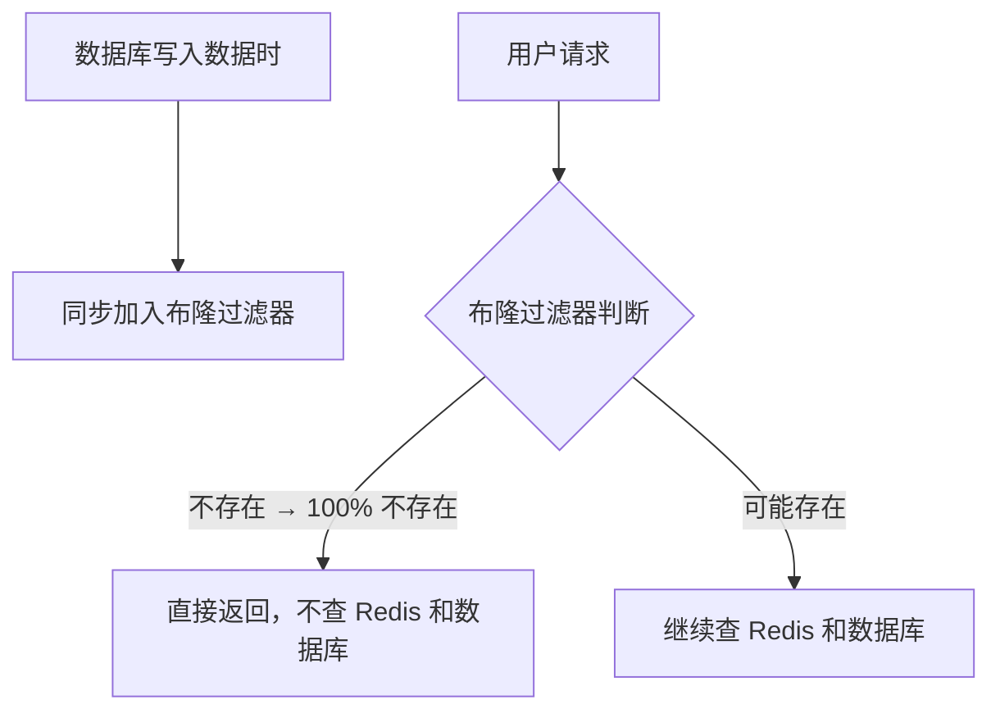

100 万个不存在的 id，在布隆过滤器这一关就全部拦截，数据库丝毫不受影响。

#### 两种方案对比

| | 缓存空值 | 布隆过滤器 |
|--|---------|----------|
| 实现难度 | 简单 | 稍复杂 |
| 适合场景 | 少量重复的非法请求 | 大量不同的非法请求 |
| 缺点 | 内存浪费，大量攻击时失效 | 有极低误判率，不支持删除 |

---

### 4.2 缓存击穿

#### 什么是缓存击穿

缓存击穿跟穿透不一样，数据是真实存在的，只是缓存**过期**了。

想象这个场景：某个明星突然爆出大新闻，全国网友疯狂刷新，这条新闻的缓存恰好在这个瞬间过期了。

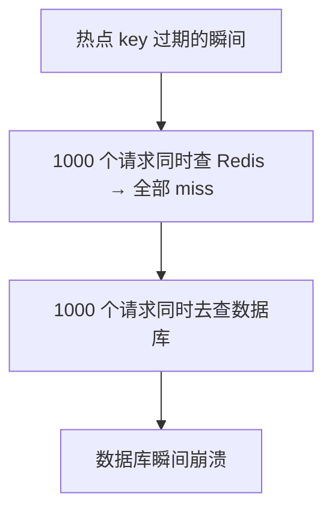

#### 解决方案一：互斥锁

只让**一个请求**去查数据库，其他请求等待：

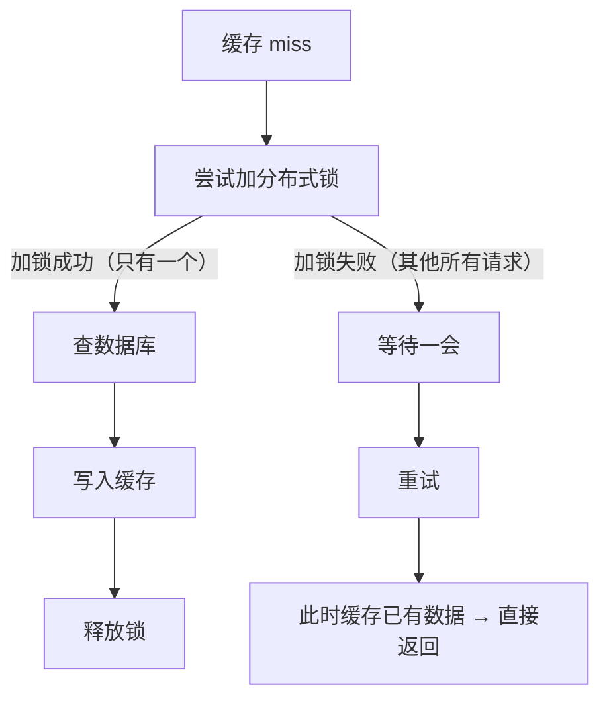

**优点**：数据强一致，缓存重建期间不会有脏数据。

**缺点**：等待期间请求被阻塞，有短暂延迟。

#### 解决方案二：逻辑过期

缓存**永不过期**，但在 value 里存一个逻辑过期时间：

```json
{
  "data": "实际数据",
  "expireTime": 1716000000
}
```

请求来了：

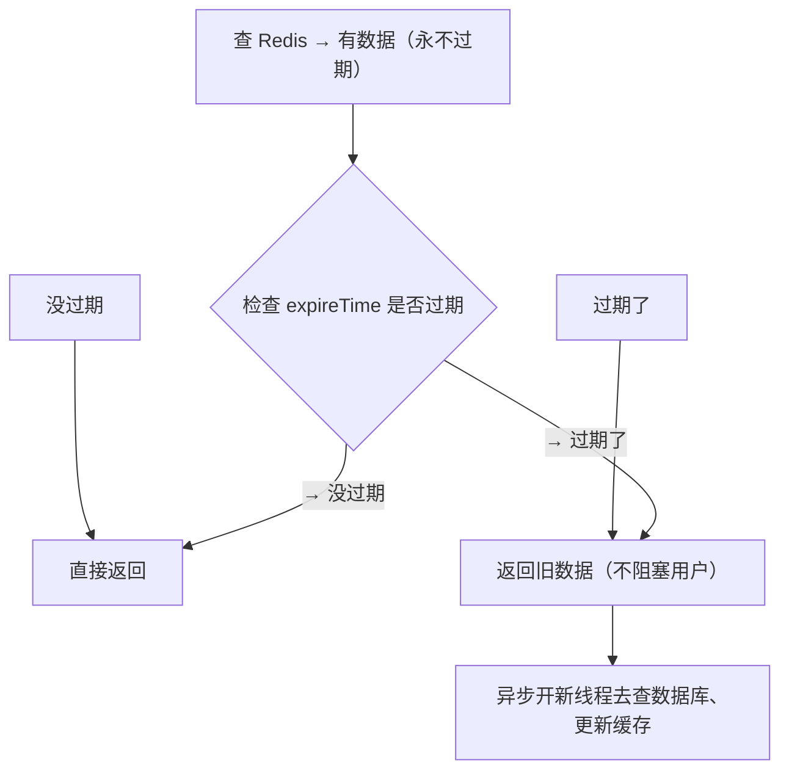

**优点**：用户不会被阻塞，始终有数据返回。

**缺点**：缓存更新前用户会拿到短暂的旧数据（最终一致，不是强一致）。

#### 两种方案对比

| | 互斥锁 | 逻辑过期 |
|--|--------|---------|
| 一致性 | 强一致 | 最终一致 |
| 可用性 | 等待期间有延迟 | 始终有数据，无延迟 |
| 实现难度 | 低 | 较高 |
| 适合场景 | 对数据一致性要求高 | 对可用性要求高，允许短暂旧数据 |

---

### 4.3 缓存雪崩

#### 什么是缓存雪崩

缓存雪崩可以理解为**更大规模的击穿**。有两种场景：

**场景一：大量 key 同时过期**

比如你的系统上线时，给所有商品设置了相同的过期时间（比如都是凌晨 12 点过期），那凌晨 12 点之后，所有商品缓存全部失效，大量请求同时打到数据库。

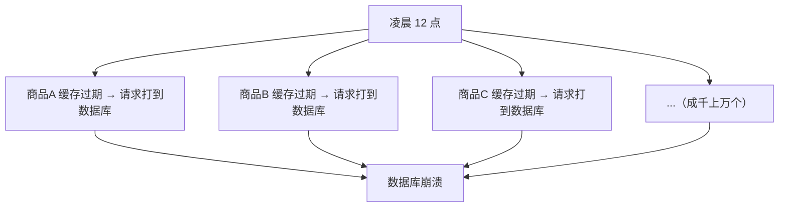

**场景二：Redis 实例宕机**

更严重的情况：Redis 整个挂掉了，所有缓存全部失效，100% 的请求打到数据库。

#### 场景一的解决方案：随机过期时间

不要给所有 key 设置相同的过期时间，加上一个随机偏移量：

```
商品A 过期时间 = 3600 秒 + 随机(0~300 秒)
商品B 过期时间 = 3600 秒 + 随机(0~300 秒)
商品C 过期时间 = 3600 秒 + 随机(0~300 秒)
```

这样 key 会**分批过期**，不会同一时间全部失效，数据库的压力就分散了。

#### 场景二的解决方案：集群高可用

单个 Redis 宕机是难以避免的，所以要部署多个 Redis 节点，一个挂了其他的顶上：

- **主从复制**：一主多从，数据有备份
- **哨兵模式**：主节点挂了，哨兵自动把从节点升级为主节点
- **Cluster 集群**：数据分散在多个节点，任意节点挂了影响只有一部分

此外还可以加**本地缓存（如 Caffeine）**作为第二道防线：


Redis 挂了，本地缓存还能兜底，不会所有请求全部打到数据库。

---

### 三大问题总结

| 问题 | 本质 | 解决方案 |
|------|------|---------|
| **缓存穿透** | 查询不存在的数据，每次都打到数据库 | 布隆过滤器 / 缓存空值 |
| **缓存击穿** | 热点 key 过期，大量请求同时打到数据库 | 互斥锁 / 逻辑过期 |
| **缓存雪崩** | 大量 key 同时过期 / Redis 宕机 | 随机过期时间 / 集群高可用 |

---

### 小结

> 这三个问题的区别在于触发条件不同：
>
> **穿透**是查询数据库里根本不存在的数据，缓存和数据库都 miss，每次都会打到数据库。解决方案是用布隆过滤器拦截不存在的请求，或者把空值也缓存起来。
>
> **击穿**是某个热点 key 过期的瞬间，大量并发请求同时 miss，全部涌入数据库。解决方案是加互斥锁，让请求排队，只有一个去查数据库；或者用逻辑过期，让缓存永不过期、异步更新。
>
> **雪崩**是更大范围的问题：大量 key 同时过期就用随机过期时间分散压力；Redis 直接宕机就用集群高可用方案，一个节点挂了其他节点顶上。

---

## 五、Redis 持久化机制

Redis 的数据存在内存里，速度快，但有一个致命问题：**断电后数据会丢失**。

持久化就是为了解决这个问题：把内存里的数据保存到磁盘上，Redis 重启后可以从磁盘恢复。

Redis 提供两种持久化方式：**RDB** 和 **AOF**，以及两者的混合模式。

---

### 5.1 RDB（Redis DataBase）快照

RDB 是最简单的持久化方式：**在某个时间点，把内存里的所有数据拍个快照，存成一个二进制文件（默认 dump.rdb）**。

用一个类比来理解：

> 你写了一天的作业，晚上睡觉前拍了一张照片。第二天如果作业本丢了，看照片就能回忆起来写了什么。RDB 就是这张"照片"。

#### RDB 触发方式

**手动触发：**

```bash
# 在 redis-cli 中执行
SAVE    # 阻塞 Redis，直到快照完成（生产环境慎用）
BGSAVE  # 后台异步执行，不阻塞（推荐）
```

**自动触发（redis.conf 配置）：**

```
save 900 1     # 900 秒内至少有 1 个 key 被修改，触发快照
save 300 10    # 300 秒内至少有 10 个 key 被修改，触发快照
save 60 10000  # 60 秒内至少有 10000 个 key 被修改，触发快照
```

#### RDB 工作原理

```
BGSAVE 命令 → Redis fork 一个子进程 →
  子进程把内存数据写入临时文件 →
  写入完成后，用临时文件替换旧的 dump.rdb
```

注意：fork 子进程时使用了**写时复制（Copy-On-Write）**技术。父进程继续处理请求，只有被修改的数据页才会被复制，所以不会阻塞正常操作。

#### RDB 优点

- **文件紧凑**：二进制格式，体积小，适合备份和灾难恢复
- **恢复速度快**：直接加载二进制文件，比 AOF 快得多
- **性能影响小**：BGSAVE 在子进程中完成，主进程几乎不受影响

#### RDB 缺点

- **数据可能丢失**：两次快照之间的数据，如果 Redis 崩溃就没了
- **fork 耗时**：数据量大时，fork 子进程可能耗时较长，期间内存占用翻倍

---

### 5.2 AOF（Append Only File）日志

AOF 的持久化方式跟 RDB 完全不同：**记录每一条写命令，追加到日志文件末尾**。

用一个类比来理解：

> RDB 是拍照片，AOF 是录视频。每一步操作都记录下来，重启时把命令重新执行一遍，数据就恢复了。

#### AOF 触发方式（redis.conf 配置）

```
appendonly yes                    # 开启 AOF
appendfsync always                # 每次写命令都同步到磁盘（最安全，最慢）
appendfsync everysec              # 每秒同步一次（推荐，性能和安全的平衡）
appendfsync no                    # 由操作系统决定何时同步（最快，最不安全）
```

#### AOF 工作原理


#### AOF 重写

AOF 文件会越来越大，因为记录了所有写命令，包括重复操作。比如对一个 key 执行了 100 次 SET，AOF 文件会保存 100 条记录，但实际上只需要最后一条。

AOF 重写就是解决这个问题：


重写后的 AOF 文件只包含恢复当前数据所需的最少命令，体积大幅减小。

#### AOF 优点

- **数据更安全**：每秒同步一次（everysec），最多丢失 1 秒数据
- **文件可读**：AOF 是纯文本的命令日志，可以手动编辑修复
- **追加写入**：磁盘顺序写入，性能稳定

#### AOF 缺点

- **文件体积大**：通常比 RDB 文件大很多
- **恢复速度慢**：需要逐条执行命令，数据量大时恢复时间长
- **性能略低**：频繁的 fsync 操作会影响吞吐量

---

### 5.3 RDB vs AOF 对比

| | RDB | AOF |
|--|-----|-----|
| 持久化方式 | 定时快照 | 记录每条写命令 |
| 文件大小 | 小（二进制） | 大（文本日志） |
| 数据安全性 | 可能丢失两次快照之间的数据 | 最多丢失 1 秒数据（everysec） |
| 恢复速度 | 快 | 慢 |
| 性能影响 | fork 时可能有短暂停顿 | 持续 fsync，吞吐量略低 |
| 适用场景 | 允许少量数据丢失，追求快速恢复 | 数据安全优先，能接受较慢恢复 |

---

### 5.4 混合持久化（Redis 4.0+）

Redis 4.0 引入了混合持久化，结合了两者的优点：

```
aof-use-rdb-preamble yes    # 开启混合持久化
```

混合持久化的 AOF 文件格式：

```
[ RDB 全量快照 ] + [ AOF 增量命令日志 ]
```

- 前半部分是 RDB 快照，恢复速度快
- 后半部分是 AOF 增量日志，保证数据安全

这样既有了 RDB 的快速恢复能力，又有了 AOF 的数据安全性，是生产环境的推荐配置。

---

### 5.5 生产环境建议

| 场景 | 推荐方案 |
|------|---------|
| 缓存（丢了可以从数据库重建） | 关闭持久化，追求极致性能 |
| 一般业务 | RDB 定时快照 + 定期备份 |
| 对数据安全要求高 | 混合持久化（aof-use-rdb-preamble yes） |
| 极端安全要求 | AOF + appendfsync always（性能损失大） |

---

## 六、Redis 内存管理与淘汰策略

Redis 的数据全在内存里，那内存满了怎么办？

---

### 6.1 maxmemory 配置

Redis 允许设置最大内存限制：

```
# redis.conf
maxmemory 2gb          # 限制 Redis 最多使用 2GB 内存
maxmemory-policy noeviction  # 内存满时的淘汰策略
```

如果不设置 maxmemory：
- 64 位系统：默认无限制，直到系统内存耗尽
- 32 位系统：默认限制 3GB

**生产环境一定要设置 maxmemory**，否则 Redis 可能吃光所有内存，导致系统崩溃。

---

### 6.2 内存满了会发生什么？

当 Redis 使用的内存达到 maxmemory 限制时，行为取决于 `maxmemory-policy` 配置：

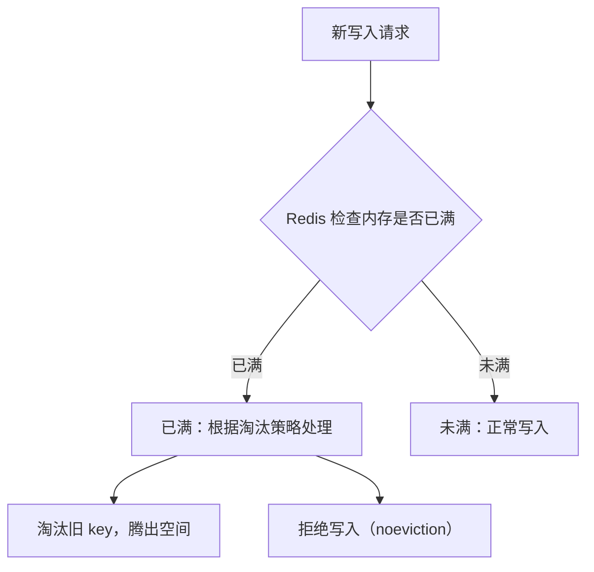

---

### 6.3 8 种淘汰策略

Redis 提供 8 种淘汰策略，分两大类：**只淘汰设置了过期时间的 key** 和 **淘汰所有 key**。

#### 第一类：只淘汰设置了过期时间的 key（volatile-*）

| 策略 | 行为 | 适合场景 |
|------|------|---------|
| **volatile-lru** | 淘汰最近最少使用的、有过期时间的 key | 缓存场景（默认推荐） |
| **volatile-lfu** | 淘汰使用频率最低的、有过期时间的 key | 热点数据缓存 |
| **volatile-random** | 随机淘汰有过期时间的 key | 所有 key 访问概率差不多 |
| **volatile-ttl** | 淘汰即将过期的 key（TTL 最小的） | 希望尽快清理快过期的数据 |

#### 第二类：淘汰所有 key（allkeys-*）

| 策略 | 行为 | 适合场景 |
|------|------|---------|
| **allkeys-lru** | 淘汰最近最少使用的 key（不管有没有过期时间） | 通用缓存，最常用 |
| **allkeys-lfu** | 淘汰使用频率最低的 key | 需要保留热点数据 |
| **allkeys-random** | 随机淘汰任意 key | 所有 key 访问概率差不多 |

#### 特殊策略

| 策略 | 行为 | 适合场景 |
|------|------|---------|
| **noeviction** | 不淘汰任何 key，写入时直接报错 | 数据不能丢失的场景 |

---

### 6.4 LRU vs LFU：怎么选？

LRU 和 LFU 是最常用的两种策略，区别在于"淘汰谁"的判断标准不同：

**LRU（Least Recently Used，最近最少使用）：**

> 类比：你的书桌上只放最近看过的 5 本书。如果来了第 6 本，就把最久没看的那本放回书架。
>
> 关注的是"最近什么时候用过"。

**LFU（Least Frequently Used，最不经常使用）：**

> 类比：你的书桌上只放最常看的 5 本书。如果来了第 6 本，就把总阅读次数最少的那本放回书架。
>
> 关注的是"总共用了多少次"。

**对比：**

| | LRU | LFU |
|--|-----|-----|
| 关注点 | 最近访问时间 | 访问频率 |
| 对新数据 | 友好，新数据不会被立刻淘汰 | 不友好，新数据访问次数少容易被淘汰 |
| 对热点数据 | 如果一段时间不访问会被淘汰 | 即使一段时间不访问，只要历史次数高就不容易被淘汰 |
| 适合场景 | 数据访问有时间局部性 | 数据访问有稳定的热度分布 |

**生产建议：**
- 大多数缓存场景用 `allkeys-lru` 就够了
- 如果数据有稳定的热点分布，用 `allkeys-lfu` 更好

---

### 6.5 内存优化小技巧

| 技巧 | 说明 |
|------|------|
| 使用 Hash 代替多个 String | 存用户信息时，`user:1001` 用 Hash 比 `user:1001:name`、`user:1001:age` 多个 key 更省内存 |
| 设置合理的过期时间 | 不用的数据及时清理，避免内存浪费 |
| 监控内存使用 | 用 `INFO memory` 命令定期检查内存占用 |
| 避免大 key | 一个 Hash 存 100 万个字段不如拆分成多个，大 key 会导致操作阻塞 |

---

## 七、Redis 分布式锁

在分布式系统中，多个服务实例可能同时操作同一个资源（比如扣减库存）。单机环境可以用 `synchronized` 或 `ReentrantLock`，但分布式环境下需要一个**所有服务都能访问到的"第三方组件"**来维护锁的状态，Redis 天然适合这个角色。

---

### 7.1 最基础的分布式锁

利用 Redis 的 `SETNX`（SET if Not Exists）命令：

```bash
SETNX lock_key 1
```

- Key 不存在 → 设置成功，返回 1（加锁成功）
- Key 已存在 → 设置失败，返回 0（加锁失败）

**❌ 致命缺陷：死锁**

如果服务获取锁后还没释放就挂了，这个 Key 永远存在，后续所有请求都会阻塞。

---

### 7.2 给锁加过期时间

为了解决死锁，给锁加一个过期时间：

```java
// ❌ 错误示范：非原子操作
if (redis.setnx("lock_key", 1) == 1) {
    redis.expire("lock_key", 10);  // 设置 10 秒过期
    try {
        doBusiness();
    } finally {
        redis.del("lock_key");
    }
}
```

**❌ 致命缺陷：非原子性**

`SETNX` 和 `EXPIRE` 是两条指令。如果第一行执行完服务器就挂了，锁依然没有过期时间，死锁问题还在。

---

### 7.3 正确的加锁方式（Redis 2.6.12+）

Redis 扩展了 `SET` 命令，支持同时设置 NX 和过期时间：

```bash
SET lock_key unique_value NX PX 10000
```

- `NX`：Not Exists，不存在才设置
- `PX`：过期时间（毫秒），10000 = 10 秒
- `unique_value`：唯一标识（比如 UUID），用于安全释放锁

```java
// ✅ 正确示范：原子操作
String lockValue = UUID.randomUUID().toString();
Boolean locked = redis.set("lock_key", lockValue, 
    SetParams.setParams().nx().px(10000));

if (locked) {
    try {
        doBusiness();
    } finally {
        // 安全释放：只有锁的持有者才能删除
        if (lockValue.equals(redis.get("lock_key"))) {
            redis.del("lock_key");
        }
    }
}
```

---

### 7.4 安全释放锁

上面的代码还有一个问题：`get` 和 `del` 是两条指令，中间可能被其他客户端插入操作。需要用 **Lua 脚本**保证原子性：

```lua
-- 释放锁的 Lua 脚本
if redis.call("get", KEYS[1]) == ARGV[1] then
    return redis.call("del", KEYS[1])
else
    return 0
end
```

```java
// 用 Lua 脚本原子性地释放锁
String luaScript = 
    "if redis.call('get', KEYS[1]) == ARGV[1] then " +
    "    return redis.call('del', KEYS[1]) " +
    "else " +
    "    return 0 " +
    "end";

redis.eval(luaScript, 1, "lock_key", lockValue);
```

这样确保了"解铃还须系铃人"——只有加锁的客户端才能释放锁。

---

### 7.5 锁续期（Watch Dog 机制）

还有一个隐藏问题：如果业务执行时间超过了锁的过期时间，锁会被自动释放，其他客户端就能获取锁，导致并发问题。

**解决方案：后台线程自动续期**

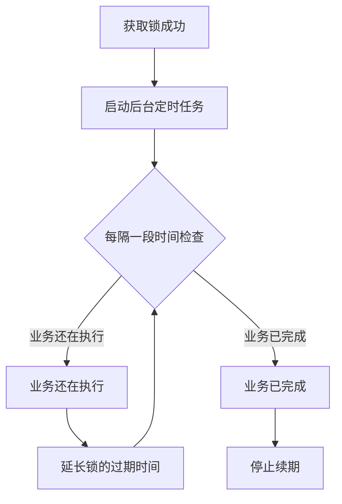

这就是 Redisson 等客户端的 **Watch Dog（看门狗）** 机制。实际开发中，推荐直接使用 Redisson，而不是自己实现分布式锁。

---

### 7.6 Redlock 算法（多实例分布式锁）

单个 Redis 节点有宕机风险，Redis 作者提出了 **Redlock** 算法，在多个独立的 Redis 实例上获取锁：

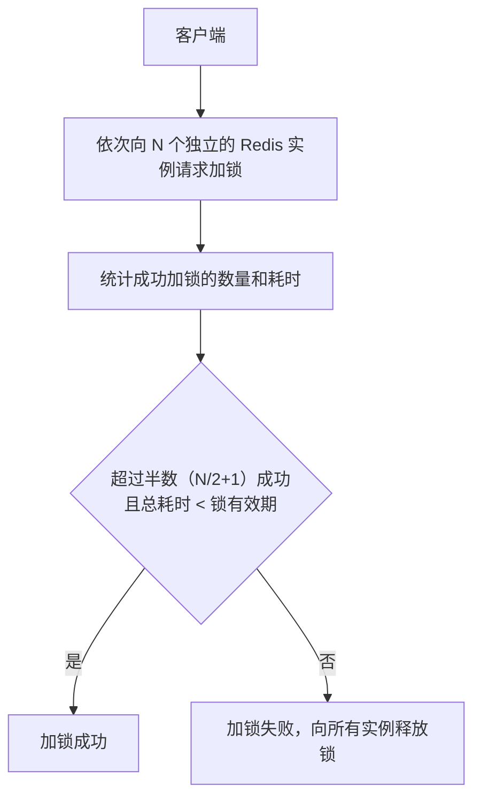

Redlock 保证了即使个别 Redis 节点宕机，锁机制依然能正常工作。但实现复杂，争议也较大，大多数场景下单实例 + 哨兵已经够用。

---

### 7.7 分布式锁的四个核心条件

一个合格的分布式锁必须满足：

| 条件 | 说明 |
|------|------|
| **互斥性** | 任意时刻只能有一个客户端持有锁 |
| **无死锁** | 客户端崩溃后锁能自动释放（靠过期时间） |
| **安全性** | 锁只能被持有者删除（靠唯一值 + Lua 脚本） |
| **高可用** | Redis 故障时锁机制依然工作（靠集群/哨兵） |

---

### 7.8 生产建议

| 场景 | 推荐方案 |
|------|---------|
| 单机/简单场景 | `SET key value NX PX` + Lua 释放 |
| 生产环境 | 直接用 **Redisson** 客户端（内置 Watch Dog、可重入等） |
| 极端高可用 | Redlock 算法或改用 ZooKeeper |

---

## 八、Redis 集群方案

Redis 单机部署宕机会导致缓存雪崩，所以生产环境都要用集群方案。有三种，一个比一个强：

---

### 8.1 方案一：主从复制

**结构：**

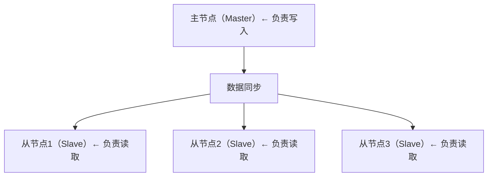

**工作方式：**

- 所有写操作打到主节点
- 主节点把数据**异步同步**给所有从节点
- 读操作可以分散到从节点（读写分离）

**缺点：**

- 主节点挂了，需要**手动**把一个从节点改成主节点，期间服务不可用
- 同步是异步的，主节点挂了前的最后一点数据可能丢失

---

### 8.2 方案二：哨兵模式（Sentinel）

在主从复制的基础上，加了**哨兵节点**来自动监控和切换。

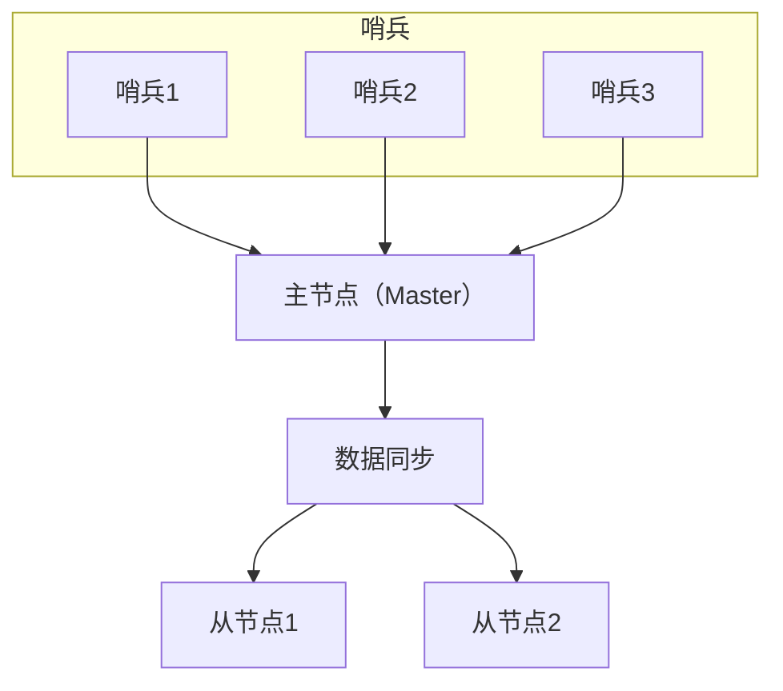

**当主节点挂掉：**

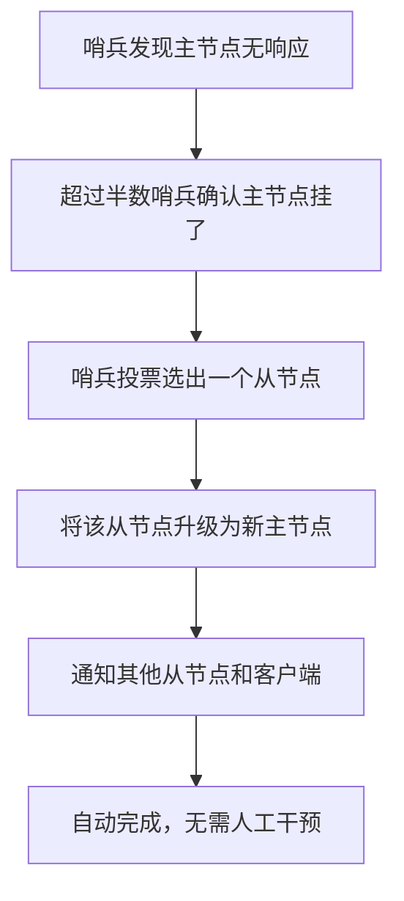

**优点**：故障自动转移，不需要手动操作。

**缺点**：数据量太大时，单节点放不下。

---

### 8.3 方案三：Cluster 集群

数据量太大，一台 Redis 放不下怎么办？把数据**分散**到多个节点。

**原理：**

Redis Cluster 把所有数据分成 **16384 个槽（slot）**，每个节点负责一部分槽：

```
节点A：负责槽 0~5460
节点B：负责槽 5461~10922
节点C：负责槽 10923~16383
```

存数据时：`CRC16(key) % 16384` 算出这个 key 属于哪个槽，存到对应节点。

**优点：**
- 数据水平分散，突破单机内存限制
- 每个节点还可以有从节点，保证高可用

**缺点：**
- 不支持跨节点的事务
- 实现复杂度最高

---

### 8.4 三种方案对比

| | 主从复制 | 哨兵模式 | Cluster 集群 |
|--|---------|---------|------------|
| 高可用 | ❌ 需手动切换 | ✅ 自动切换 | ✅ 自动切换 |
| 水平扩展 | ❌ | ❌ | ✅ |
| 复杂度 | 低 | 中 | 高 |
| 适用场景 | 数据量小，可接受手动维护 | 数据量中等，需要自动故障转移 | 数据量大，需要水平扩展 |

---

### 8.5 主从同步会丢数据吗？

会，但概率极低。因为主从同步是**异步**的：

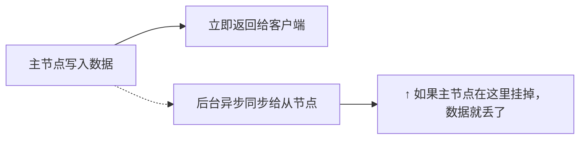

还有一种情况叫**脑裂**：

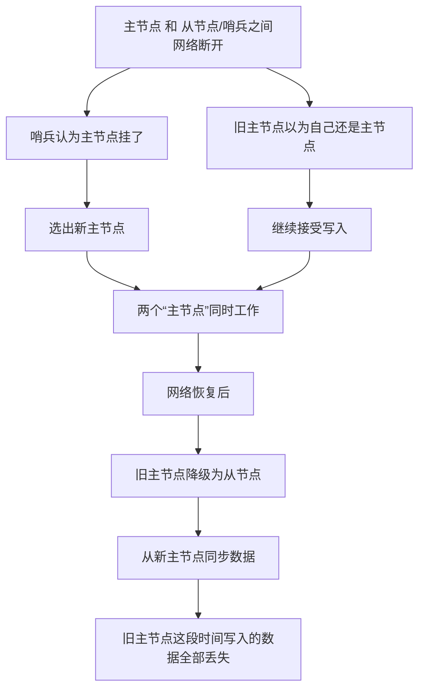

这个数据丢失在大多数缓存业务里是**可以接受的**，因为缓存丢了最多是从数据库重新加载，不会影响数据的正确性。
